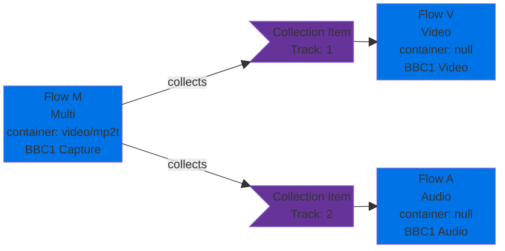
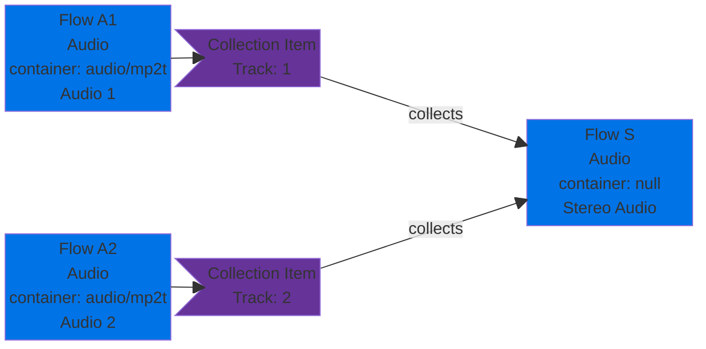
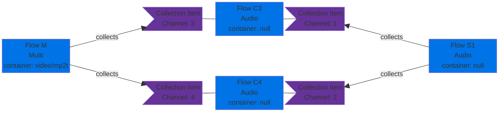

# Channel Mapping

## Context and Problem Statement

In the course of considering how the `role` property of a Flow collection should be used (in [ADR0047](./0047-role-naming-convention.md)) one of the use cases discussed was describing audio channels: for example how to indicate a particular Flow was the left or right channel of a stereo pair.
The various TAMS examples describe doing this using `role`, however doing so overloads a human-readable free-text field in a way that isn't ideal.
This ADR considers other approaches to capturing the same information.

The container mapping described in [AppNote 0006](../appnotes/0006-containers-and-mappings.md) allows for a Flow to be described without essence (`container` is unset), where the essence is instead found as part of another Flow.
The example given shows an audio Flow referencing a multi-essence Flow, using the `CollectionItem` object to identify how to map essence tracks in the multi-essence Flow to each mono-essence.
When encountering such a mono-essence Flow, a player must note that `container` is not set, and search the list of Flows collected by that Flow to locate one where it is set.

> [!NOTE]
> Note that throughout this document, the term "concrete" is used to refer to a Flow that has `container` set

### Audio Channel Shuffling

In the example below, to play Flow A, a player must search Flows that Flow A is collected by, and locate Flow M, which has the `CollectionItem` object.
This is an inversion of the convention when presented with a multi-essence Flow with no `container`, where the `collects` should be searched to find the Flows that make up that multi-essence Flow.

Figure 1: Simple mapping example

However this model does not explicitly support the reverse, where Flows with essence are mapped to specific channels of another Flow, or re-mapped similar to an audio channel "shuffler".
Consider the example of _Figure 2_ where two mono-essence single-channel audio Flows are collected to form a stereo pair.
This seems theoretically possible, but is not explicitly called out in the documentation.

Figure 2: Stereo pair from discrete audio Flows

A more complex example may be a Flow containing all 16 channels of audio from an SDI capture, multiplexed together into a single multi-essence Flow.
The user wishes to extract channels 3+4 and have them represent the Left and Right channels of a stereo pair.
In principle they can do so by adding a Flow for each audio channel (with a `collects` relationship) to the 16 channel mux, and then adding a further Flow representing the stereo pair:

Figure 3: Multi-stage mapping example  
Note that in this diagram, every Flow has a matching Source, omitted for clarity.

This presents a problem when a player comes to play Source S1.
It identifies that Source S1 is represented by Flow S1, gets Flow S1 and finds no `container` set.
In the previous example it then had to proceed "up" the hierarchy, however here it must apply the more common convention with multi-essence Flows, and search "down" to locate the component channels.
Once Flows C3 and C4 have been located, the player must notice the further lack of a `container` property, and search the list of Flows they are collected by.
Flow S1 can be eliminated: it also doesn't have a `container` tag, leading eventually back to Flow M.
Ideally there should be an unambiguous algorithm to locate the correct Flow (with `container` set) to play.

In addition in _Figure 3_ Flow S1 is an Audio Flow (specifically `urn:x-nmos:format:audio`) whereas Flow M is a Multi Flow (`urn:x-nmos:format:multi`): TAMS contains no specific guidance as to which is correct in this case, and the ambiguity further complicates the matter.

### Video Channel Mapping

There are more limited use cases for mapping channels in video, such as where multiple tracks exist on an NLE timeline, or where TAMS is used to describe how multiple video tracks map into a container format.

## Decision Drivers

[AppNote 0006 Containers and Mappings](../appnotes/0006-containers-and-mappings.md#audio-track-channel-mapping) describes how to describe a Flow containing a subset of another Flow's audio channels, and notes such usage may be restricted.
The examples described work for examples such as extracted video and audio from a Flow in which they are multiplexed (corresponding to an asset elsewhere, such as a file).
However the existing documentation has some limitations:

* There are no examples for mapping audio, e.g. the case where a concrete Flow contains stereo audio: by adding a Flow under `collects` describing each channel, and setting `container_mapping` for each Collection Item, individual channels could be assigned an ID, however there is no example or documentation.
* There is ambiguity as to whether the reverse case is possible, where a pair of concrete mono-essence audio Flows are collected as the left and right channels of a stereo pair.
* As noted above, the approach breaks down given more complex cases with multiple steps to reach the essence.
* It is not clear where Multi-essence vs Audio/Video Flows should be used.

We should have clear guidance on how to handle these complex cases, and what players and readers are expected to do.

## Considered Options

* Option 1: Consider audio Flows to be indivisible into channels
* Option 2: Map down: use existing `container_mapping` only to describe single channels of a concrete Flow
* Option 3: Map bidirectionally: allow `container_mapping` to compose audio channels
* Option 4: Map bidirectionally, but require one end be concrete
* Option 5: Map down for Multi, up for Audio Flows

## Decision Outcome

Chosen option: "{title of option 1}", because
{Justification, e.g., only option which resolves requirements, or comes out best (see below)}.

### Implementation

{Once the proposal has been implemented, add a link to the relevant PRs here}

## Pros and Cons of the Options - for Audio Mapping

### Option 1: Consider audio Flows to be indivisible into channels

Consider that an audio Flow containing multiple channels (such as stereo audio) cannot be divided into channels using the `collects` mechanism in TAMS.
The `container_mapping` property exists solely to allow separate tracks (such as video and stereo audio) to be described as part of a multiplex, for example representing a muxed MPEG-TS.
If dividing it further is desired, the user must carry out that division and create a series of new, independent Flows, or describe that extraction elsewhere, such as a composition format used by a Digital Audio Workstation (DAW).

* Good, because it avoids having to add further complexity into the specification or players
* Good, because it aligns with existing usage of TAMS (and player implementations): no known implementations attempt to do what is described in _Figure 2_
* Bad, because it means audio channel shuffling cannot be represented as a metadata-only operation, unlike the "write once, use many" approach allowed elsewhere
* Bad, because it limits a class of use case for TAMS where content is received from e.g. an SDI ingest and repackaged, which is otherwise enabled by the Source/Flow model
* Bad, because the Source/Flow hierarchy supports this operation for cases such as an A/V mux, but doesn't for audio channels, which seems unexpected

### Option 2: Map down: use existing `container_mapping` only to describe single channels of a concrete Flow

Update the documentation to indicate that `container_mapping` can also be used to describe a single channel within a multi-channel audio Flow, where that multi-channel Flow is concrete.
This is mapping "down", in the sense that `container_mapping` is read from a collection (with concrete essence) down to the items collected, in the same way as a video Flow might be extracted from a specific track in a muxed segment.
However the example in _Figure 2_ above is _not_ possible, and this sort of mapping should be captured elsewhere (e.g. in a composition format such as [OpenTimelineIO](../appnotes/0015-using-tams-in-opentimelineio.md)) or a new Flow should be created containing the stereo pair.
Players are not expected to be able to perform audio channel shuffling.

* Good, because it avoids having to add further complexity into the specification or players
* Good, because it aligns with existing usage of TAMS (and player implementations): no known implementations attempt to do what is described in _Figure 2_
* Good, because it makes channel mapping explicit in a format designed for the purpose, which can link back to TAMS Sources (or Flows)
* Bad, because it means audio channel shuffling cannot be represented as a metadata-only operation, unlike the "write once, use many" approach allowed elsewhere
* Bad, because the Source/Flow hierarchy supports this operation for cases such as an A/V mux, but doesn't for audio channels, which seems unexpected
* Bad, because it may lead to audio channel mappings being stored in a more brittle way, such as using `role`

### Option 3: Map bidirectionally: allow `container_mapping` to compose audio channels

Update the documentation to indicate that `container_mapping` can be used both to describe a single channel within a concrete multi-channel audio Flow, and how to combine a number of concrete single-channel Flows into a multi-channel Flow.
As a result, _Figure 2_ becomes possible in TAMS, as theoretically does _Figure 3_.
However for the latter to work a player or reader must conduct a somewhat complex process to find concrete Flows: given a Flow to play it may be necessary to explore both `collects` and `collected_by` to find suitable concrete essence.

* Good, because it explicitly and flexibly expresses channel mappings
* Good, because it clarifies a behaviour that seems like it should already work in TAMS
* Good, because it allows complex shuffling behaviours to be expressed as a metadata operation
* Bad, because it increases complexity in every conformant player to select and extract audio channels from multi-channel essence segments
* Bad, because it also increases the complexity of locating concrete Flows, since a player/reader may need to extensively traverse the graph to locate suitable essence
* Bad, because there is no way to understand these collections in the Source graph

### Option 4: Map bidirectionally, but require one end be concrete

As for Option 3, except in this case if a `CollectionItem` has a `container_mapping` then at least one of the Flow that is collected, or the Flow it is collected by must be concrete.
In this case the approach in _Figure 3_ is no longer possible, however a version could be implemented if Flows C3 and C4 were made concrete, and re-used objects from Flow M (with `container_mapping` set on each of C3 and C4 to indicate how to extract the correct track).

Pros and cons are as for Option 3, except:

* Good (compared to Option 3), because it simplifies the process of finding a concrete Flow
* Neutral, because it constrains the flexibility allowed in channel mapping, but not significantly

### Option 5: Map down for Multi, up for Audio Flows

As Option C3, except further specify that a multi-essence Flow which is not concrete should always be read by searching the Flows in `collects`, while mono-essence should look at the Flows in `collected_by`.
Note that this does not work with the example in _Figure 3_: Flow S1 would have to become multi-essence.

Pros and cons are as for Option 3, except:

* Good (compared to Option 3), because it simplifies the process of finding a concrete Flow
* Bad, because it overloads detail about a Flow into the format, in a way that is unintuitive

### Option 6: Map down where the Flow `collects` other Flows

As Option Option 3, except further specify that a non-concrete Flow that collects other Flows always has collected concrete Flows.

Pros and cons are as for Option 3, except:

* Good (compared to Option 3), because it simplifies the process of finding a concrete Flow
* Bad (compared to Option 3), because it may unexpectedly limit flexibility (e.g. Flow A in _Figure 2_ could not be further divided into individual channels).

As Option 3, except further specify that if a Flow has a `collects` property but no `container` a reader should attempt to read the Flows under `collects` to find suitable essence to play.
In the example above, to play Flow S1 a player notes that `collects` is set, and tries to play each element of the collection instead, realising that to do so it then has to search `collected_by` to find an entry with a `container`.

* Good, because it requires players to only search in one direction to find playable media
* Good, because it aligns with how multi-essence Flows work in general: if there is no `container` but there are collected Flows, they contain the essence content of the multi-essence Flow.
* Good, because it unambiguously works with the Flow S1 example above
* Bad, because it prevents multi-layer channels, however there is no clear use case for this
