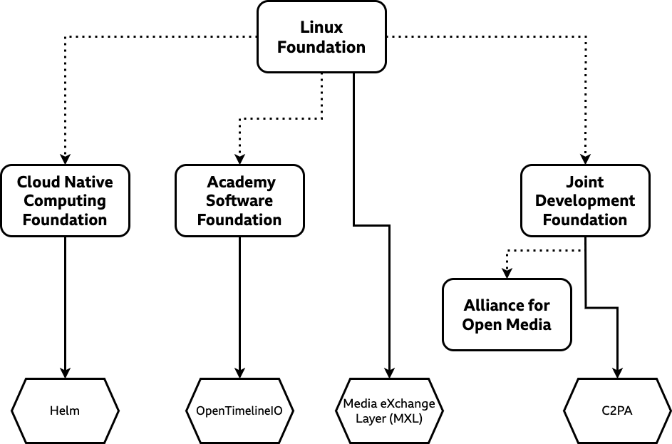

# Host Organisation for TAMS

## Context and Problem Statement

[ADR0046](./0046-governance.md) considered options for the future governance of TAMS, and concluded that it should move to an organisation such as the Linux Foundation.
At that time a process was set out (described in [GOVERNANCE.md](https://github.com/bbc/tams/blob/2190650f824b86bc6e53320538427cf0446d34e0/GOVERNANCE.md#phase-1-setup-period-now)) to form a TSC, identify a suitable organisation and move TAMS under it.
This ADR documents possible organisations and the associated decision.

## Decision Drivers

The TSC [identified](https://github.com/bbc/tams/wiki/TSC-Meetings-2026#next-steps-on-governance) a number of aspects to consider when selecting an organisation:

- How does governance work for projects?
  What is involved?
- What is the underlying legal structure?
- What is the funding model?
  Is it a paid membership organisation?
  Can non-members be involved?
- Is there a stated Intellectual Property Rights (IPR) policy/position?
- If there is a community, where is it?
  Can we join?
- Are they being talked about/engaged by organisations we’re working with in the TAMS Community?
  Can we see any evidence of that happening?

## Considered Options

Several possible organisations were identified, from discussions and suggestions by the TSC, their colleagues and others at the meetings.
Note that these options are in no particular order, except as to make the rest of the document flow better.

- Option 1: Linux Foundation (LF)
- Option 1a: Linux Foundation, with funding
- Option 2: Academy Software Foundation (ASWF)
- Option 3: Cloud Native Computing Foundation (CNCF)
- Option 4: Joint Development Foundation (JDF)
- Option 5: Alliance for Open Media (AOM)

These options are all related, as illustrated by the following diagram (where boxes are organisations, and hexagons are example projects):

## Decision Outcome

Chosen option: **TBD**, because...

### Detailed SWOT Analysis of Options

To aid making this decision, an analysis of Strengths, Weaknesses, Opportunities and Threats (SWOT) was conducted to provide another lens for analysing the options, as captured in the table below.
In this context a Strength is akin to a "Good" in the ADR options, a Weakness akin to a "Bad", an Opportunity is something positive that could come to pass with some work (or some good luck) as a result, and a Threat is the opposite - something negative that could come to pass, but that is less certain than a Weakness.

Alliance for Open Media (Option 5) has been removed from the scope of this analysis as it is unlikely to be a good fit based on the heavy focus on AV1, which TAMS is related to, but not closely.
Similarly Cloud Native Computing Foundation (Option 3) has also been removed from the scope, since it seems to consider projects which exist at another layer of the stack to TAMS and is otherwise very similar to the Academy Software Foundation (Option 2).
<!-- markdownlint-disable MD033 -->
<table>
  <thead>
    <tr>
      <th>Option</th>
      <th>Strengths</th>
      <th>Weaknesses</th>
      <th>Opportunities</th>
      <th>Threats</th>
    </tr>
  </thead>
  <tbody>
    <tr>
      <td rowspan="3"><b>Linux Foundation</b> (Option 1)</td>
      <td>Closest to existing model</td>
      <td>Have to form/grow/run own community</td>
      <td>May be able to move beyond media & entertainment</td>
      <td>May face some limitations/restrictions by being unfunded</td>
    </tr>
    <tr>
      <td>Light-touch overall with considerable freedom</td>
      <td></td>
      <td>Could move to another sub-foundation/switch to funded later</td>
      <td></td>
    </tr>
    <tr>
      <td>Keeps the most options open in future</td>
      <td></td>
      <td></td>
      <td></td>
    </tr>
  <tr>
      <td rowspan="3"><b>Linux Foundation, funded</b> (Option 1a)</td>
      <td>Similar to existing model</td>
      <td>Have to form/grow/run own community</td>
      <td>May be able to move beyond media & entertainment</td>
      <td>Unlikely to be able to switch back to unfunded later</td>
    </tr>
    <tr>
      <td>Light-touch overall with considerable freedom</td>
      <td>Significant upfront and ongoing costs for our community</td>
      <td></td>
      <td>May be complex for the BBC to be involved (likely on a special Associate tier)</td>
    </tr>
    <tr>
      <td>Clear approach to how we manage funding</td>
      <td></td>
      <td></td>
      <td></td>
    </tr>
    <tr>
      <td rowspan="4"><b>Academy Software Foundation</b> (Option 2)</td>
      <td>Ready-made community</td>
      <td>More process around managing the project</td>
      <td>Making a common home for open source media software and unifying with fellow travellers (e.g. OpenTimelineIO)</td>
      <td>Positions TAMS initially within Media & Entertainment: limits multi-use applicability</td>
    </tr>
    <tr>
      <td>Existing funding and structure</td>
      <td>Harder to join and set up: more process and structure involved</td>
      <td>Growing towards the film/VFX industry as a broader TAMS market</td>
      <td>Film/VFX prominence overshadows the more broadcast/news positioning of TAMS</td>
    </tr>
    <tr>
      <td></td>
      <td>Need to move existing community</td>
      <td>May help push into poorly served regions: e.g. US market</td>
      <td>Lots of work involved for us in broadening ASWF beyond film/VFX</td>
    </tr>
    <tr>
      <td></td>
      <td></td>
      <td>Some effort from Premier tier members, who provide 1x FTE</td>
      <td>Some cultural mismatch due to different sectors/industries/geographies: may be high-friction</td>
    </tr><tr>
      <td rowspan="2"><b>Joint Development Foundation</b> (Option 4)</td>
      <td>More rigourous handling of IPR</td>
      <td>Differs from how TAMS works today, which is much more like a software project</td>
      <td>Possible path to formal standardisation, if that's a route we want to take</td>
      <td></td>
    </tr>
    <tr>
      <td></td>
      <td>Not aimed at developing/owning software directly</td>
      <td></td>
      <td></td>
    </tr>
    <tr>
      <td rowspan="2"><b>Form a sub-foundation</b> (<a href="./0046-governance.md#option-5-form-a-new-industry-organisation">ADR0046 Option 5</a>)</td>
      <td>Provides a common space for open source broadcast software to grow</td>
      <td>Lots of work for us to set it up, and high overhead to run</td>
      <td>Potentially fills a gap in our sector</td>
      <td>There are many other organisations that partially cover this need, and adding a "competitor" is challenging and risky</td>
    </tr>
    <tr>
      <td>Considerable freedom to set direction and approach</td>
      <td>Likely to require some kind of funding plan for e.g. legal support and admin costs</td>
      <td>May be able to join forces with comparable open source broadcast technology under and common framework</td>
      <td></td>
    </tr>
    <tr>
      <td rowspan="4"><b>Retain the status quo</b> (<a href="./0046-governance.md#option-1-keep-tams-under-the-control-of-the-bbc">ADR0046 Option 1</a>)</td>
      <td>No effort required</td>
      <td>No legal entity or trademark protection</td>
      <td></td>
      <td>Project could stall if the BBC re-prioritise away from it</td>
    </tr>
    <tr>
      <td>TSC already functioning</td>
      <td>Perceived as BBC-owned &mdash; limits adoption</td>
      <td>None: this is the baseline we're trying to improve on</td>
      <td>Single-org perception limits vendor adoption and contributions</td>
    </tr>
    <tr>
      <td>Working so far...</td>
      <td>Contributors and TSC members lack any formal governance rights or status</td>
      <td></td>
      <td>Subject to BBC enterprise controls: org is not really set up for this!</td>
    </tr>
    <tr>
      <td></td>
      <td></td>
      <td></td>
      <td>BBC Charter renewal means long-term outlook remains unknown</td>
    </tr>
  </tbody>
</table>
<!-- markdownlint-enable MD033 -->

### Implementation

{Once the proposal has been implemented, add a link to the relevant PRs here}

## Pros and Cons of the Options

Note that in keeping with the other TAMS ADRs, options are characterised as “Good”, “Bad” or “Neutral”.
For the avoidance of doubt, that should be read as “a good/bad fit for the TAMS project at this time” rather than a value judgement on the organisations in question, and the wording exists as a very simple way to express strengths and weaknesses.

### Option 1: Linux Foundation

Become a project directly under the Linux Foundation, like [Media eXchange Layer (MXL)](https://github.com/dmf-mxl/mxl/).

At a basic level, Linux Foundation projects are required to use an open source licence, have a documented charter that separates their technical governance from the business needs of the organisations involved and allows anyone to participate in the technical community, and transfer ownership of their assets (repositories, domains, etc.) to a neutral party.

In terms of that neutral party, Linux Foundation projects are a “series” of LF Projects, LLC, a “series limited liability company” under Delaware law.
This effectively allows each project to be a distinct legal entity under the parent organisation, with separate obligations, assets and liabilities, without the overhead of managing a large number of companies (_note that this is the author's layperson's understanding, and not a qualified legal opinion_).
This option specifically considers the "Community Project" [style of project](https://www.linuxfoundation.org/projects/hosting).

On IPR, it seems to rely on Apache 2.0 and similar licences containing a patent grant and then [Developer Certificate of Origin (DCO)](https://wiki.linuxfoundation.org/dco) sign-off indicating you were able to licence that contribution under Apache 2.0.
There is some cross-LF activity to defend members from Non-practicing Entities (also known as "patent trolls") depending on membership tier.

Linux Foundation projects have considerable freedom to operate as they see fit and build a community where they’d like.
To set up a project requires the support of at least one Linux Foundation member (both the BBC and AWS are members) and five sponsoring organisations (although it isn’t clear what that means).

- Good, because it offers us considerable freedom in how to operate TAMS
- Good, because it allows our existing community and process to remain, only changing the underlying ownership
- Good, because it is the lightest-touch of the options
- Good, because it creates space for TAMS applications outside of the Media & Entertainment sector, where it may find broader adoption
- Good, because it has proven templates for setting up the legal and IP framework around the TAMS specification
- Neutral, because while it is not a direct fit for TAMS, the Linux Foundation overall is very broad
- Neutral, because there would be additional steps to operate as a funded project, however this is no different to the existing model
- Bad, because we have to form, grow and run our own community (rather than being participants in an existing one)

### Option 1a: Linux Foundation, with funding

As Option 1, but use the "Community Project + Funding" form of [Linux Foundation project](https://www.linuxfoundation.org/projects/hosting), like the [Yocto Project](https://www.yoctoproject.org/).

In this model organisations become members of the project in exchange for an annual membership fee, which is put towards infrastructure, events and similar (with the Linux Foundation taking 8%).
They are a Directed Fund where paying members at an appropriate level receive some control over how the project is run and the funds are spent (e.g. through seats and votes on the Governing Board) and other benefits, however technical participation is open to all.

- Good, because it offers us considerable freedom in how to operate TAMS
- Good, because it allows our existing community and process to remain, only changing the underlying ownership
- Good, because it is the lightest-touch of the options
- Good, because it creates space for TAMS applications outside of the Media & Entertainment sector, where it may find broader adoption
- Good, because it has proven templates for setting up the legal and IP framework around the TAMS specification
- Neutral, because while it is not a direct fit for TAMS, the Linux Foundation overall is very broad
- Neutral, because there would be additional steps to operate as a funded project, however this is no different to the existing model
- Bad, because we have to form, grow and run our own community (rather than being participants in an existing one)
- Bad, because several of our community would need to put in substantial funding (both to join our project, and if necessary the Linux Foundation) to get set up

### Option 2: Academy Software Foundation (AWSF)

Join the Academy Software Foundation (ASWF) as a project, like [OpenTimelineIO](https://github.com/AcademySoftwareFoundation/OpenTimelineIO).

ASWF is a subsidiary of the Linux Foundation, and shares many of the same aspects, for example the legal structure and requirements around licences, participation and ownership.
Its [charter](https://cdn.platform.linuxfoundation.org/agreements/aswf.pdf) describes its scope as:

> open source or open specification projects supporting the motion picture industry

The Foundation itself reads this fairly broadly, listing among its [goals](https://www.aswf.io/about/) to "share resources across the motion picture and broader media industries", however in practice many of the projects and members are active in the animation and visual effects space.

It is a membership organisation (a "Directed Fund" of the Linux Foundation), applying the overall principle of separating technical governance from business direction, while providing a way to collect funds and spend them to further its goals based on the direction of [member organisations](https://www.aswf.io/members/).
For example, the ASWF funds its use of Slack and has a Working Group managing (and where necessary funding) some [CI infrastructure](https://www.aswf.io/ci-infrastructure/).

It also comes with more requirements in initial submission, including considering the potential "universe of participants" and presenting for approval to the [Technical Advisory Council (TAC)](https://tac.aswf.io/).
There is also a project lifecycle process into which projects are slotted: Sandbox, Incubation, Graduated, Archived.
Projects aim to move up from Sandbox to Incubation (or at least make demonstrable progress) within one year.
Moving to Incubation requires some more complete documentation and pass a growth assessment.
Annual Reviews take place to re-assess lifecycle stage and look over current activity, stage match and feedback.

#### Slack and Community

One of our considerations is around what happens to the existing TAMS community, which is currently centred around a few core spaces (e.g. the CNAP Slack) and events (TAMSCon, the Community Call, etc.)

It seems the [ASWF Slack](https://slack.aswf.io/) is viewed as an enabler for the community it serves: providing a space for the groups involved to come together around a shared goal.
Members and participants have deep expertise is a wide variety of topics, and it serves the variety of projects under the ASWF umbrella well.
A few of the TSC members are also members of the ASWF Slack and can see the variety of technical discussions that take place, of a similar character to those in the CNAP Slack (however there are a number of useful private channels within the CNAP workspace: it is not clear to what extent this is possible in the ASWF community).

The ASWF Slack community is geared around a channel-per-project, e.g. there is a `#opentimelineio` channel, plus a handful of working group channels (e.g. `#opentimelineio-examples`).
In theory it is possible to merge workspaces together, exporting data from our existing workspace and then importing it to the new one, which would reduce (but not entirely mitigate) the impact of moving spaces.
One of the aspects the ASWF funds is a Slack Pro licence for their workspace, enabling retention of the message history beyond the 3-month limit of Slack Free.

#### Events

Typically ASWF has a set of events that run across the Foundation: broadly the Open Source Forum, Open Source Days and Dev Days.
Of these the Open Source Forum and Open Source Days a in-person presentation sessions about software, open source and best practices (in Los Angeles) open to Foundation members, or members plus individuals for a registration fee.
Dev Days is a "hackathon" day where participants give a day of their time to work on a task from an Academy Software Foundation project.

In addition to this the various projects and Working Groups have their TSC and other meetings on a regular cadence, along with the fortnightly TAC meeting.

Currently the in-person events are in Los Angeles, although the Foundation have expressed that growing into Europe would have some appeal.

#### Pros and Cons

- Good, because it is well aligned with the sector TAMS works in
- Good, because it provides a ready-made community to join an grow
- Good, because it provides a ready structure to manage funding and spending on resources
- Neutral/bad, because it is currently VFX/film focused (but seems keen to grow wider than that)
- Neutral/bad, because it introduces more process around managing the project
- Neutral/bad, because current events are all in the US (California) and the TAMS community is currently much more focused in Europe: many existing participants would be unable to attend in-person
- Bad, because it positions TAMS firmly within Media & Entertainment, when the technology may be more widely useful
- Bad, because it likely forces us to move our existing community, which may come at a cost of engagement and participation
- Bad, because we'd lose some of the freedom we enjoy to run and manage events within our community
- Bad, because very few of the existing TAMS community are Members of ASWF: in principle this isn't a barrier to technical participation, but limits event access

### Option 3: Cloud Native Computing Foundation (CNCF)

Join the Cloud Native Computing Foundation as a project, like [Helm](https://github.com/helm/helm).

CNCF is another subsidiary of the Linux Foundation, and shares many of the same aspects much like ASWF.
It is intended for projects that contribute to cloud-native ecosystem and provides a vendor-neutral home for open-source cloud-native projects.

Broadly a similar project lifecycle approach applies as with ASWF: there is an acceptance process for new projects, which then move through the stages.
On community, there are individual communities around projects (such as the Kubernetes community) but the broader cloud-native ecosystem means one community (e.g. a single Slack) is less likely to be practical.

- Bad, because most of the CNCF projects exist at a lower level that TAMS, providing underlying compute and platform capabilities to support a wide variety of applications, such as Kubernetes and Helm
- Bad, because we have to form, grow and run our own community (rather than being participants in an existing one)

### Option 4: Joint Development Foundation (JDF)

Form a Joint Development Foundation under the Linux Foundation, like the [Coalition for Content Provenance and Authenticity (C2PA)](https://github.com/c2pa-org).

JDF projects are a specific Linux Foundation structure intended for standards and specification projects, with a potential path to more formal standardisation.
JDF projects can also be funded or unfunded, and member organisations can be Steering Members, General Members and Contributor Members.
They are operated by a Steering Technical Committee (STC), which can run either "designated by consensus" (the model on which the TAMS TSC operates) or "designated by steering member", where Steering Member organisations provide a representative.
There’s also two operational modes: either “Community specification” (like TAMS, work is conducted asynchronously in public repos) with licences built for spec work, or “Traditional specification” as a more conventional specification process (C2PA is understood to use the latter).

JDF projects come with a more rigorous handling of IPR (especially in “Traditional” mode) requiring it to be considered explicitly, rather than the more general implicit grant in other projects through licences like Apache 2.0.

- Good, because it is intended for building specifications
- Good, because it has a more rigorous handling of IPR
- Neutral/bad because it is not aimed at building software directly, which increases friction should the TAMS community wish to own any software (e.g. store implementations).
- Bad, because the approach seems to differ somewhat from how TAMS is currently running as an open source project

### Option 5: Alliance for Open Media (AOM)

Become a project under the Alliance for Open Media, like [AV1](https://aomedia.org/specifications/av1/).

AOM is a JDF predominantly concerned with the developmnt and promotion of the AV1 codec.
While there is a working group considering [Storage and Transport Formats](https://aomedia.org/about/organization/#storage-and-transport-formats-working-group) the primary concern seems to be the codec itself.

- Bad, because of the significant focus on AV1

## Appendix: Detailed Organisation Research

Based on the [questions laid out above](#decision-drivers), research was carried out into each candidate organisation.
This was used as the basis of each Option, the Pros and Cons and the SWOT analysis above, and is reproduced here for completeness.

### How does governance work?

<!-- markdownlint-disable MD033 -->
|  | How does governance work? |
| -- | -- |
| Academy Software Foundation | The principles of the ASWF include open licence, separation of technical concerns, open participation and neutral ownership. TAMS being framed as a broadcast technology falls outside of the organisation scope of motion picture and special effects. There is a clear application, approval and project governance process that seeks to facilitate a universe of participants and encourage phased progression and growth. |
| Alliance for Open Media | With foundations in the AV1 codec the scope of the organisation has expanded to include working groups, each with a select focus. There appears to be alignment with TAMS and the objectives of the Storage and Formats working group. Steering group governance stems from a hierarchy of steering committees from member organisations. |
| Cloud-native Computing Foundation | The principles of the CNCF are for projects to contribute to the cloud-native echo system and to be a vendor neutral home. Organisations are self-governed and supported by an oversight committee which can provide support when called upon, supported by standard templates that can be adjusted to meet project needs and criteria to encourage project progress. |
| Joint Development Foundation | The organisation is focused on the fast initialisation of projects moving to longer-term standards and specifications (including source code and data).  A clear process of execution of the membership agreement and the establishment of a project charter with a capability to include project sponsorship. |
| Linux Foundation | The foundation requires projects to use an approved open source licensing model supported by a clear strategy for Intellectual Property ownership and for all assets to be neutrally owned.  Oversight is minimal, with a focus on the separation of business and technical governance to be documented in a charter. |
<!-- markdownlint-enable MD033 -->

|  | What is the legal structure? |
| -- | -- |
| Academy Software Foundation | US Law, 501c6 Series LLC (Limited Liability Company). |
| Alliance for Open Media | The organisation has adopted a number of patent, software and contributor licence agreements that are aligned with the objectives of the organisation and that contributors must comply. Operates within the organisation of the Joint Development Foundation. |
| Cloud-native Computing Foundation | US Law, 501c6 Series LLC (Limited Liability Company). |
| Joint Development Foundation | US Law, operates as a subsidiary of the Joint Development Foundation Projects (501 non-profit). |
| Linux Foundation | US Law,. 501c6 LLC (Limited Liability Company), each project is ‘series’ which is a subset of the LLC. |

|  | What evidence is there of existing unfunded projects, would it be compatible with TAMS? |
| -- | -- |
| Academy Software Foundation | The foundation is formed to manage the curation of a community, a number of projects (approximately ten) supported by funding to be used by all projects. |
| Alliance for Open Media | Unclear. |
| Cloud-native Computing Foundation | The foundation is formed to manage the curation of a community, a number of projects (approximately ten) supported by funding to be used by all projects. |
| Joint Development Foundation | Participation is accepted with no fee or sponsorship. |
| Linux Foundation | Participation is feasible under both community and funding models, and additional scope for combinations. Models without funding receive less support than those with funding, the Linux foundation receives a percentage of the funding to aid support and organisation. |

|  | How are Intellectual Property Rights managed and addressed? |
| -- | -- |
| Academy Software Foundation | It is dependent on the software licence that the project adopts, TAMS uses Apache 2.0 which grants permission to use the code and contributors own their own copyright. |
| Alliance for Open Media | The organisation has a set of patent licences that govern how IPR is managed. |
| Cloud-native Computing Foundation | The organisation charter clearly defines how IPR is to be managed and which specific licences are to be adopted and used. |
| Joint Development Foundation | A flexible approach with a series of well-defined policies being offered to projects to adopt that are aligned with established copyright licences and options. |
| Linux Foundation |It is dependent on the software licence that the project adopts, TAMS uses Apache 2.0 which grants permission to use the code and contributors own their own copyright. |

|  | How is the community managed? |
| -- | -- |
| Academy Software Foundation | In addition to annual events, the organisation leverages an establish digital community and has discovered that this is enabling a wider community of ideas and knowledge sharing alongside membership projects.  |
| Alliance for Open Media | This is a project of the Joint Development Foundation and it is likely that communities are out of scope. |
| Cloud-native Computing Foundation | An established large community around the cloud-native ecosystem which would require integration from the existing TAMS community. |
| Joint Development Foundation | The organisation is focused on the principles of establishing work and communities are out of scope. |
| Linux Foundation | The foundation provides a set of tools to support project management and community integration; projects are expected to manage communities independently. |
