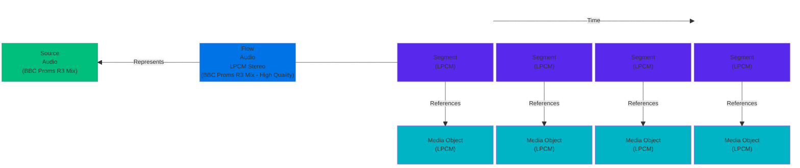
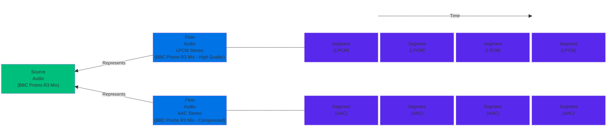
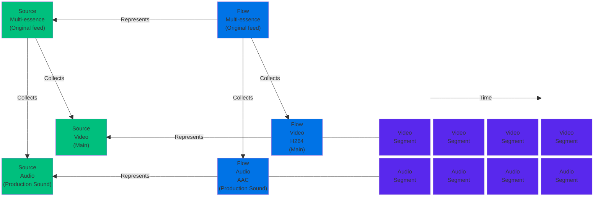
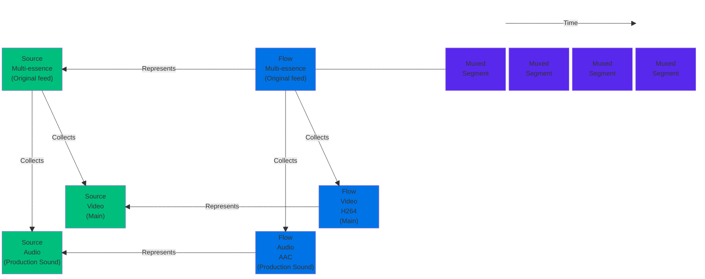
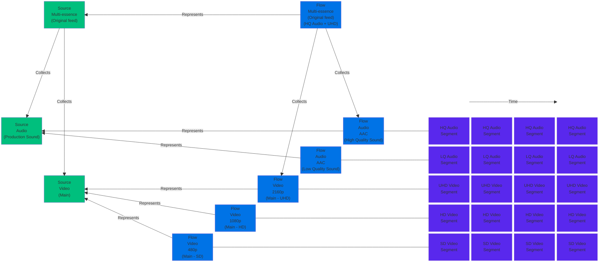
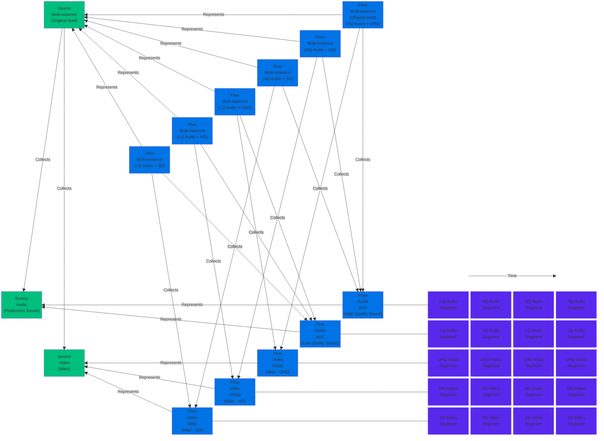
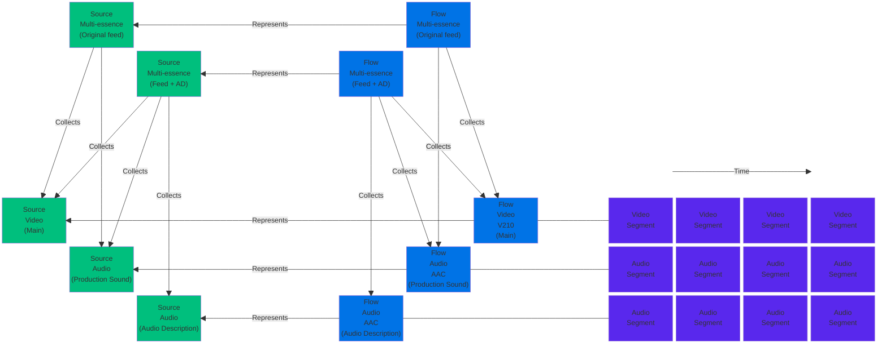
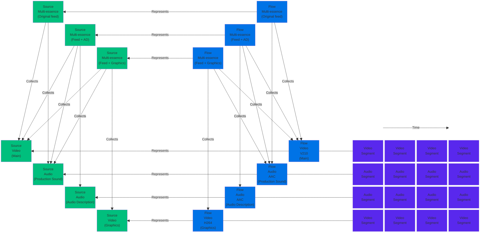
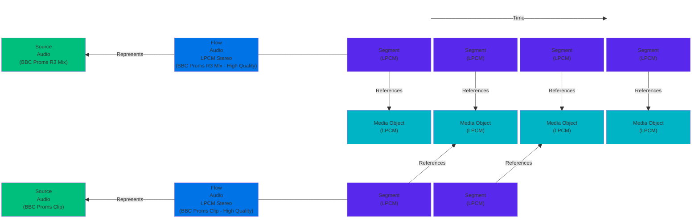
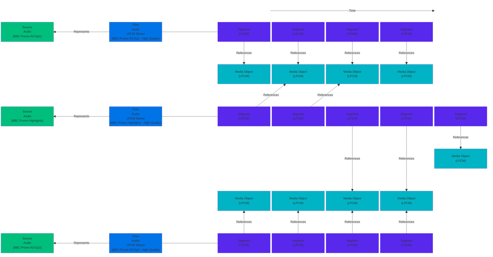

# Practical Application of the TAMS Content Model

## Abstract

This application note covers the basic principles of the Time Addressable Media Store's (TAMS) Content Model and explains how it can be applied to describe and manage media through some simple practical examples.
The terms `Source` and `Flow` are introduced and their meaning and usage are explored.
This short article will show you how `Flows` and `Sources` support flexible multi-format working and allow you to store, reference and synchronise sets of media elements at whatever level of granularity is required for your use cases.

## Content

### Describing and Managing Media with Flows and Sources

The Time Addressable Media Store uses strong, universally unique identifiers to manage and track media assets.
In most cases, these identifiers are coined when media is placed in the store (either by a file or stream ingest operation).

> [!NOTE]
> Ingest of media originating from an NMOS-compliant streaming device may persist the [NMOS identifiers](https://specs.amwa.tv/ms-04/releases/v1.0.0/docs/2.1._Summary_and_Definitions.html), since they conform to the same underlying model.
Future implementations of stream handling infrastructure may choose to embrace the TAMS content model more fully, adding identity and timing information that could be captured into the store, providing consistency between the streamed and stored domains.

Each media element is given a `Flow ID`, which is used to reference the content via the API.
This media is typically chunked and stored as Media Objects.
These Media Objects are typically short (on the order of seconds) and independently decodable to allow for efficient random access of content.
Media Objects are mapped to a Flow's timeline via Flow Segments.

Once media is in the store, it is considered immutable and never modified directly.
A Flow's `Flow ID`, its Flow Segments, and their relationship to the Flow's timeline never changes.
This ensures that when you request a particular `Flow ID` and timerange via the API, you always get the same media back.

The length of Media Objects is dependent on limitations of codecs and their configuration (such as GOP sizes) along with a trade-off between number of requests to upload/download content, cost, and granularity.
Multiple Flow Segments, in the same or different Flows, may reference the same Media Object.
Flow Segments may reference partial Media Objects, allowing for frame/sample accuracy.
This is particularly useful when re-using existing Media Objects in so-called edit-by-reference workflows.

`Sources` provide another layer of identity that groups together editorially-equivalent `Flows`, making it easy to find different representations of the same content.
For example, consider two `Flows`, comprising an H264 bitstream and a JPEG2000 bitstream respectively, representing the same sequence of pictures.
They share a `Source ID` and exist on the same timeline.
A request for the same timerange of either `Flow` will result in the same picture or sequence of pictures when decoded.
By extension, content can be referenced independent of its encoding by using the `Source IDs` directly, allowing clips and assembly edits to be described in purely editorial terms.

The TAMS content model provides a `collection` mechanism for grouping several mono-essence `Flow` entities together under a multi-essence `Flow` (Multi-Flow).
Mono-essence `Flows` can be referenced by any number of Multi-Flows via their `flow_collection` attribute.
Counterpart `source_collection` attribute also exist against `Sources` and are created by TAMS services automatically based on their Flow equivalents.

It is considered best practice to deal with media as Sources wherever possible, particularly when presenting that media to human users.
Systems are often better placed to decide which technical representation (i.e. Flow) is most appropriate for their use than other systems or human users.
There will also typically be fewer Sources available than Flows, resulting in shorter listings in UIs etc.
These listings may, in some use cases, be further filtered to just Multi-Sources which collect related media.
It may, be appropriate to deal in Flows directly in cases where specific technical representations are important.
For example, when passing Flows to a file-export service.

Storing the media elements independently affords more flexibility in cases where media elements regularly need to be manipulated separately, as it avoids the overhead of repeated unpacking and repacking.
For example, a transcription service would need access to audio, but not video.
And generation of video proxies would not need access to audio.
Additionally, it avoids the need to create separate multiplexed streams for all combinations of audio and video qualities.
This saves on resources.

As an alternative, multi-essence streams can be stored directly in muxed form if the flexibility of elemental media is not required.
This may be of particular use where the original stream must be retained for compliance reasons.

> [!NOTE]
> TAMS use of `Sources` and `Flows` aligns with terminology used the Advanced Media Workflow Association's Networked Media Open Specifications.
TAMS extends some of the basic concepts to meet the needs of the practical applications it is designed to address.

Let's consider how the TAMS content model is used in practice through some simple examples.

### Simple Mono-essence Stream Ingest (stereo audio)

Ingest of a LPCM audio stream (for example an AES67 or SMPTE ST2110-30 stream) requires the creation of a new `Flow ID` to identify the sequence of Segments containing the audio samples, and a new `Source ID` as an editorial entity to support the linking of this media with other representations.
The chunked media is stored as Media Objects and mapped onto the Flow's timeline via Flow Segments.

> [!NOTE]
> Other examples in this Application Note omit Media Objects for brevity

> [!NOTE]
> By convention, the interleaved audio is treated as a single mono-essence `Flow`.
Implementers of media ingesters may choose to offer the option to split the interleave into several separate `Flows`.
If required, separate identifiers can be assigned to channels in an interleaved audio `Flow`, but that is beyond the scope of this application note.

### Creation of Proxy Representations

The audio Flow created in the previous example is encoded to produce a new AAC representation of the media.
A new `Flow ID` is coined to identify the new sequence of Segments.
The correspondence of the underlying samples to the timeline is inherited from the original media.
The new `Flow ID` is linked to the same `Source ID` as the original audio `Flow`.
Handling of alternative representations of video (and other types of media) follow the same pattern.

> [!NOTE]
> The duration of the Segments in the derived `Flow` may differ due to technical constraints of the encoding algorithm or other reasons.
In this case, Segment timestamps will be remapped so the relationship between the timeline and the underlying media samples is preserved.

### Ingest of SRT Stream (video + stereo audio)

Stepping up to a stream containing both audio and video, packaged into a MPEG2 Transport Stream and encapsulated in SRT, three `Flow` entities are created on ingest: one for the video essence, one for the audio essence and a Multi-Flow to record the association of the mono-essence `Flows` as an ingested stream.
The Multi-Flow features a `collection` attribute that lists the `Flow IDs` in the set, each annotated with a string describing its role.

Technical metadata relating to the elementary streams is used to populate the corresponding mono-essence `Flow` properties.

For maximum flexibility, the video and audio essence is demuxed on ingest and stored separately under their respective mono-essence `Flow IDs`.
The synchronisation relationship between the elements is preserved through the use of a common time index for the set.

If your use case doesn't require this flexibility, it may be more convenient to store the multi-essence stream (in this case a Transport Stream) as muxed Media Objects, with Flow Segments being populated directly against the Multi-Flow, leaving the mono-essence Flows unpopulated, as shown below.

> [!NOTE]
> Unpopulated mono-essence `Flows` collected by populated Multi-Flows are often still useful for conveying the technical properties of the tracks within the multiplexed stream of the Multi-Flow.
This aids consuming clients in identifying media they are compatible with.

### Quality Ladder

In many cases, a "quality ladder" of representations may be provided to suit different bandwidths, display resolutions, and quality requirements etc.
The general principle in TAMS is that the media required should be communicated at the Source level where possible.
It should be up to the client to decide the Flows required automatically, where possible, as it will often have more data regarding the requirements and resources available than the user.
As the number of renditions increases, the number of possible combinations also increases.
For this reason, it recommended to only create Multi-Flows where they provide value to the system.
For example the initial Flows collections that will, by extension, create the Source collections that may be used to identify different renditions.
Or the creation of a specific Flow collection to pass to render server.

> [!CAUTION]
> The following diagram is an anti-pattern that should be avoided

The following diagram demonstrates the proliferation of Flows, and exponential complexity that arises from representing all possible combinations of renditions as separate Multi-Flows.

### Addition of Ancillary or Alternative Audio

`Flows` are logically independent and are associated with other `Flows` via the `collection` mechanism, so new `Flows` can be created to augment your assets at any time.
The synchronisation relationship between two or more `Flows` is encoded into their relationship to a common timeline.
As a result, adding ancillary or alternative audio to a set of media is as simple as creating the new media co-timed with the other items in the set, and introducing a new Multi-Flow (and corresponding Multi-Source) to define the augmented media `collection`.

> [!NOTE]
> In this example, the two Multi-Flows and Sources are representing editorially distinct and useful combinations of media.
This makes the use of multiple Multi-Flows appropriate as opposed to the anti-pattern described above.

> [!NOTE]
> It's technically permissible to collect together a mixture of mono- and multi-essence Flows into a higher-level multi-essence Flow.
However, creating multi-level hierarchies like this breeds complexity and will likely impact performance, so it's inadvisable in most cases.
It's generally better to reference the lowest-level mono-essence Flows individually in the multi-essence collection.

### Addition of Video Layers

Video layers or overlays can also be stored as separate `Flows`, synchronised using the same mechanism as in the audio example above.

Being able to reference these audio and video layers independently and bind them together in different combinations offers greater flexibility in downstream media workflows, and for future re-use of media assets.

### Clipping Media

A clip of an existing Source may be represented purely in metadata, referencing the existing Media Objects.
A new Source and Flow is created as the clip may be considered editorially distinct.
The new Flow may map the existing Objects to different points on it's timeline.

### Edit-by-Reference with Multiple Flows

A new cuts-based edit may be created as a new Source and Flow that similarly references existing Media Objects from one or more Flows.
New Objects are only created for media that doesn't currently exist in the store.
Flow Segments could use a subset of the TimeRange available in a referenced Object e.g. only the first 5 seconds of a 10 second Object are needed.

