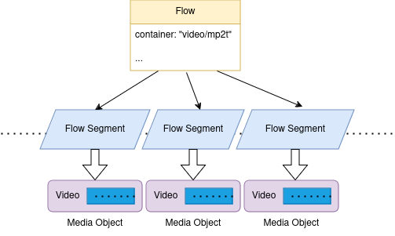
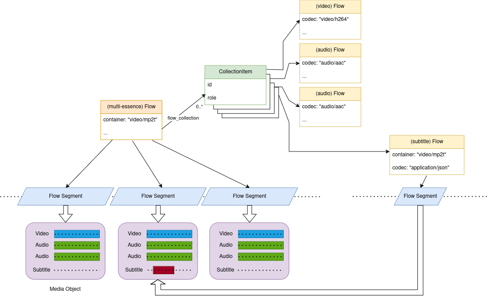
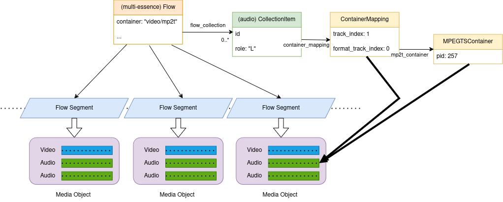
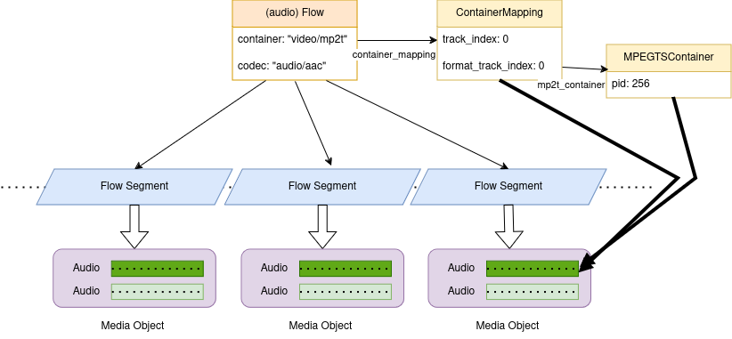

# 0006: Containers and Mappings

## Abstract

Flows reference media content stored in Media Object containers in TAMS.
The containers may have content for multiple Flows.
This application note will describe how the `container` and `container_mapping` properties are used to reference the Flow content in containers.

## Compatibility

Container functionality changed in TAMS v5.0.
This Application Note applies to TAMS v5.0+.

## Content

### Flow `container` Property

The Flow `container` property serves 2 purposes.
The `container` property identifies the container type for the Media bjects and its presence flags whether the Flow directly references Media Objects.

The `container` property is a [MIME type](https://datatracker.ietf.org/doc/html/rfc6838).
Example values are `video/mp2t` for MPEG-TS, `video/mp4` for MP4 and `application/json` for JSON.

A Flow references Media Objects either directly using Flow Segments associated with the Flow or via Flow Segments associated with a multi-essence Flow that collects (via the `flow_collection`) the Flow.

The diagram below shows a sequence of MPEG-TS Media Objects that contains video for a Flow.
The video Flow references the Media Objects via a sequence of Flow Segments.
The presence of the `container` property indicates that the Flow has Flow Segments (the list could be empty).

The diagram below shows a sequence of MPEG-TS Media Objects that contains a multplex of audio and video.
The multi-essence Flow:

- has a `container` property that indicates that this Flow has Flow Segments.
- uses its sequence of Flow Segments to reference the Media Objects.

The video and audio Flows:

- are referenced by a Collection Item in the `flow_collection` list.
- don't themselves have a sequence of Flow Segments and therefore the `container` property is not set.

The media content for these Flows are accessed using the multi-essence Flow's Flow Segments.

The diagram below shows a sequence of MPEG-TS Media Objects that contains a multiplex of audio, video and subtitles.
The subtitles in this example are very sparse compared to the audio and video.
In addition to the multi-essence Flow, the subtitle Flow references the Media Objects via a sequence of Flow Segments and has a `container` property.
This allows for a more optimised access to the subtitle media content.
The subtitle Flow Segments have different a `timerange` to the Flow Segments from the multi-essence Flow.
The subtitle Flow Segments don't reference every Media Object because not every Media Object contains subtitles.

### Flow and Collection Item `container_mapping` Property

#### Container Track Mapping

The `container_mapping` property is used to specify the location of the media content in the container.
It is needed if the mapping is ambiguous because there are multiple tracks of the same media format in the container.

The `track_index` property provides an index (starting from 0) for the container tracks.
The `track_index` can be used in applications where the set of container tracks are detectable by all readers and have a consistent ordering.

The `format_track_index` property separates the track indexing for each Flow formats.
The `format` property of the target Flow determines which index sequence is in use.
For example, a media container with a video and 2 audio tracks has a video track index 0 and audio track indexes 0 and 1.
The `format_track_index` also requires the set of container tracks to be detectable by all readers and that the tracks, per format, have a consistent ordering.

There are container specific mappings that can be used to identify the track more precisely using information that is specific to the container type.
The `mp2ts_container` can be used for MPEG-TS and provides a `pid` property to identity the packet ID for the elementary stream.
The `mxf_container` can be used for MXF and has a `package_uid` and `track_id` property.
The `isobmff_container` can be used for formats based on the ISO Base Media File Format container formats (e.g. MP4 and Quicktime) and it has a `track_id` property.

The `container_mapping` may contain multiple mapping properties to help identify the container track.
This ranges from the more precise container specific mappings like `mp2ts_container`, to `format_track_index` and then `track_index`.
Basic reader implementations may not have have access to the container specific metadata, e.g. the MPEG-TS PID.
In that case they can still use the information from the `format_track_index` or `track_index` properties.

The diagram below illustrates this for a container with video and audio tracks.
Only the Collection Item and Flow for the left audio channel in the `flow_collection` is shown.
The `container_mapping` object has `track_index` 1 (video is 0), `format_track_index` 0 (the first audio) and a `mp2t_container` object with the PID for the audio elementary stream set to 257.

#### Audio Track Channel Mapping

The `audio_track` object property has `channel_numbers` and `channel_range` properties that can be used to specify use of individual channels and reordering for multi-channel audio tracks.
This mapping requires readers to have the capability to extract and reorder individual audio channels.
This audio channel mapping capability may be restricted in a TAMS, e.g. only allow uncompressed audio.

#### Container Mapping in the Collection or Flow

The `container_mapping` property can be used in the Flow or Collection Item objects.
If a Flow is collected by a multi-essence Flow then the `container_mapping` should be specified in the Collection Item; it may be duplicated in the Flow as well.
If a Flow is not collected by a multi-essence Flow then the `container_mapping` in the Flow should be used.

The diagram below shows a Flow referencing a stereo audio track in a media container that also includes an unused alternative stereo audio track.
Only one of the stereo audio is of interest and therefore just a single audio Flow is defined to reference the Media Objects.
The audio Flow has `container` property to identify the container type and `container_mapping` to identify the target stereo audio track.
There is no need to define a multi-essence Flow because only one of the container tracks is used.

