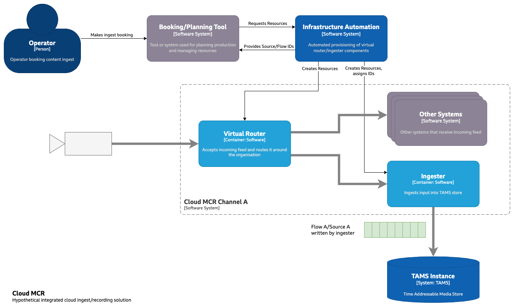
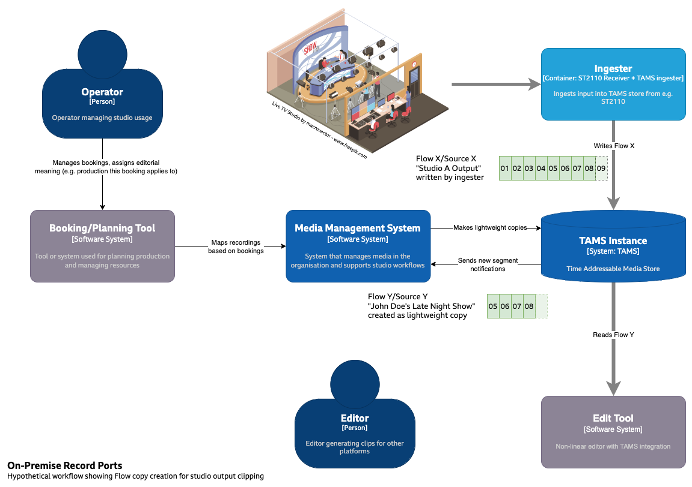

# 0010: Long-running Sources and Flows

## Abstract

The TAMS content model assigns a Source and Flow ID to each piece of content in the store, and in simple cases where a file or an ephemeral stream is ingested, it is clear a new ID should be applied to that content.
However where a fixed input is ingested that has variable content, it may be appropriate to use a long-running ID, to assign a new one as the content changes, or to use a combination of both where an ID is assigned to the input line, and a metadata-only copy is made to assign editorial meaning.

## Content

Some broadcast workflows involve the ingest and storage of a fixed input with variable content, for example continuously recording the output of a studio, or an outside source line from an agency.
Over time, this input takes on different editorial meanings: a studio may be used for multiple different bookings or an agency may provide different packages on the line.
Assigning different Source and Flow IDs to each of those meanings allows those IDs to be treated as separate items by other tools in the workflow, for example they can be considered "assets" in a Media Asset Manager.

### Cloud MCR

In a suitably integrated solution, assigning different IDs for each editorial meaning could be very simple.

For example, consider a "cloud MCR" solution that allows an organisation to receive input feeds in a variety of forms and "route" them to different systems (including TAMS-based recording), with a mechanism to place bookings for incoming content.
In this case, automation creates the infrastructure for each booking (virtual routers and ingesters and similar), however different bookings may end up sharing resources such as IP addresses.

Here, the new ingester created for the booking could have a new Source ID/Flow ID pair created and assigned, either by itself, or from some production planning system linked with the booking system.

### On-premise Record Ports

Other organisations may have a number of on-premise "record ports", e.g. the output from a studio or a routable package from a more conventional MCR.
It may be necessary for this port to be continuously recorded to satisfy compliance requirements, or to ensure late-breaking changes or unexpected usage is always recorded.

In this case it may make more sense to assign a Source ID/Flow ID pair to the record port itself, which could be labelled something like "Studio A output" (Flow X/Source X in the diagram below).
Once the editorial meaning for a period of time in that recording is known, a further Source ID/Flow ID pair can be assigned to the relevant timerange: for example by the studio booking manager, by manual markup by an operator, or a combination of methods.
The system managing the mapping of record port Flow onto editorially meaningful Flow could start this copy as soon as it has the relevant information, creating copied Flow Segments for those that exist already, then listening to [events](https://github.com/bbc/tams/tree/main?tab=readme-ov-file#events-from-the-api) to add new segments as more of the original Flow timerange is added.
If the precise timings are known (through consistent timing and accurate metadata) this mapping may be very precise, however in cases where timings can only be approximated (e.g. due to unkown signal path delays) it may be necessary to start slightly earlier, finish slightly later and accept some content overlap, which could be trimmed later.

In the example below, the studio booking system and media management system interact to create "Flow Y: John Doe's Late Night Show", containing the output of the studio during that particular booking.
This Flow may also have different access control rules, for example Flow X may be restricted to MCR and facility engineers, while Flow Y is made available to the editors for the show, for example to generate clips for other platforms.

TAMS allows multiple Flow Segments to use the same media object, providing a metadata-only copy functionality: the essence is stored once and pointed to by multiple parts of multiple Flows which allows these copies to have negligible storage requirements.
Media objects are reference counted, which means parts of the original Flow can be deleted while preserving the objects referenced by another Flow.
For example, "Studio A Output" - Flow X - may be retained for 7 days by default, with a periodic task calling `DELETE /flows/<flowX_ID>/segments` with a timerange ending 7 days ago, with no start.
However, "John Doe's Late Night Show" - Flow Y - may have a 30 day retention, in which case the 7-day deletion above will not delete the underlying objects, merely reduce the reference count to one.

