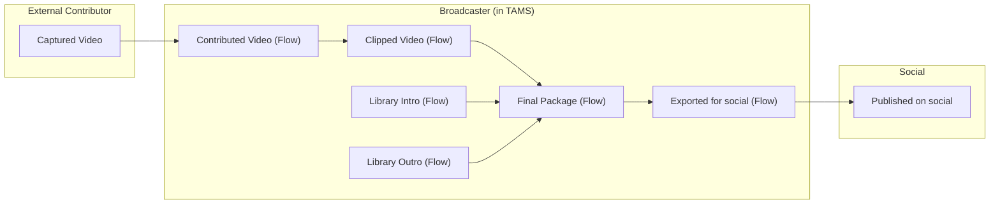
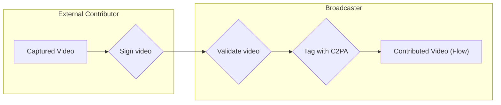
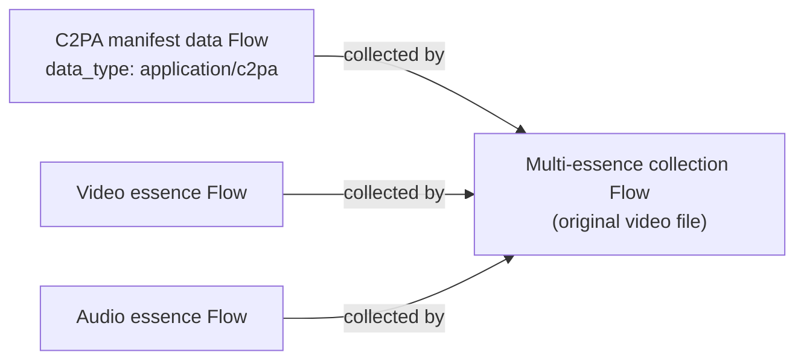
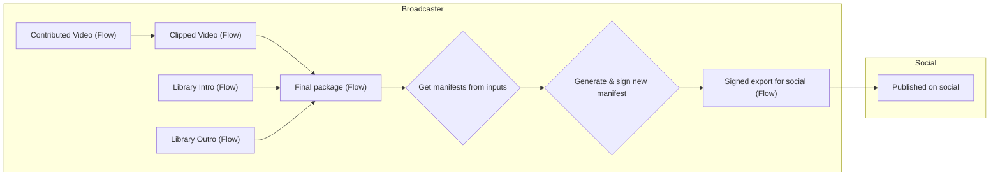

# 0011 C2PA provenance across related Sources and Flows

## Abstract

[C2PA](https://c2pa.org/), or "Content Credentials" is a metadata standard for authenticating the origin of media, and describing its provenance.
It uses certificates, cryptographic hashes, digital signatures and a tree of linked "ingredients" - links to the different versions of the assets used to create the current one.
However, as C2PA's hashing mechanism is intentionally brittle, and currently reliant on the container format, it is not obvious to imagine how to preserve provenance data across workflows involving TAMS.
Here we will examine some best practices for ingesting and exporting media from TAMS to allow clients to propagate and re-sign provenance without significant data loss.

This note is an initial recommendation on how to work with C2PA in TAMS.
Implementors are encouraged to feedback and contribute to the recommendation as the workflows and standards develop.
Notably, it is focussed on file-based Flows and Sources, awaiting further live stream container support in C2PA.

## Trust Principles

One of the key features of C2PA is the description of the "action" taken when the ["hard binding"](https://c2pa.org/specifications/specifications/2.1/specs/C2PA_Specification.html#_hard_binding) (or hash) of content changes, which could be described as a new "version".
This action is important, as it can help differentiate a purely technical change, like repackaging, or transcoding for different bitrates, from more "editorial" ones, like cutting material or overlaying graphics.

TAMS is purely a media store, and has no concept of the type of action performed on content, nor does it perform any actions _itself_.

Instead, all actions are performed by clients of TAMS.
This leads us to our guiding principle for working with C2PA in TAMS: the generation of new C2PA manifests and the associated signatures should be done by TAMS clients, potentially using data stored in TAMS.

TAMS clients writing C2PA data will **need to assume responsibility for the data they write**, which means they will need to consider the broader workflow, including other clients involved in creating the media to be signed.

In situations where the workflow that produced that the Flows and Sources being used occurred outside of the organisation signing the C2PA asset, the signing organisation exposes itself to risk if the workflow turns out to be untrustworthy.
There are a number of ways to handle this, some options are:

1. The signing organisation doing an export asks the external organisations in the workflow to include a signed C2PA manifest with their output Flows and Sources
2. The signing organisation works out-of-band with the external organisations to establish their own expectations and trust, and then signs the whole workflow themselves, assuming all the risk
3. The signing organisation makes a decision to only sign workflows that are in their control, excluding workflows where external organisations are present

## Workflow

Here's an example workflow to help us understand where C2PA validation and signing can happen.

Fig 1 - Example workflow

We will assume that the contributed video is an MP4 file including a C2PA manifest signed by the External Contributor (or by a device they own).

While out-of-scope for this application note, upon "accepting" this file, it is recommended for the broadcaster to validate the file before ingesting it into their TAMS store.
Validation checks that the signature and hash of the content are cryptographically correct (amongst other things), and also checks that the certificate that signed the manifest is also valid.
This last part can vary, depending on use case, but in the news industry, the certificate can be checked against the [IPTC's "Verified News Publisher" list](https://iptc.org/verified-news-publishers-list/), to ensure the identity of the signer is correct.

### Ingest

Once validated, the broadcaster should upload the contributed MP4 as-is into TAMS, as a single Segment.
This is done to ensure a modification-free record of the initial contribution, which preserves both the C2PA metadata, as well as its binding to the content, which, for a monolithic MP4 file, will be sensitive to any manipulation.

Fig 2 - Ingest process

As part of that upload process, the multi-essence Flow being created should be tagged with `c2pa-provenance: embedded`, to ensure the provenance can be found later at export-time.

Alternatively, depending on workflow and performance constraints, the C2PA manifest can be copied out of the file, and subsequently uploaded to TAMS as a child collected data Flow, with a `role` of `c2pa`, and an `essence_parameters/data_type` value of `application/c2pa` and a `format` value of `urn:x-nmos:format:data`.
If this is done, the multi-essence Flow's tag should instead be c2pa-provenance: detached.

Fig 3 - Detached C2PA Flow example

### Editing

In the Figure 1 workflow, the broadcaster edits the contributed video to get it ready for publication on a social media platform.
The example shows two other contributions to the final asset: an intro and outro.
Depending on the level of C2PA adoption in an organisation, these assets may have C2PA provenance data attached themselves.
For this example, we will assume they don't.

The broadcaster continues to edit the package, potentially demuxing and segmenting the contributed video, as well as cutting to length, and combining it with the intro and outro videos.
In this process, no further C2PA-specific actions need to be taken, TAMS is used as-is.
However, there is an assumption that knowledge of the edit graph is captured and retained by something outside of TAMS - this might be a non-linear editor or MAM system.
This will be critical in the next step, where a package is readied for export, and C2PA provenance data is re-added.

### Export

When the broadcaster arrives at the point where they wish to download the final package ready for upload to a social media platform, they will need to perform a number of actions to assemble a new C2PA manifest for the packaged file.

First, the broadcaster should decide the granularity of provenance data they wish to include in the C2PA manifest that will be generated.
For this application note, we will consider a "coarse-grained" approach, where C2PA manifests are not generated for each intermediate step in the edit graph.
However, implementors are free to do so, in which case, they should follow the procedure below for each intermediate step.

The broadcaster (or more likely, the software package the broadcaster is using to interact with TAMS) should generate a graph of the edits performed in order to produce the final package.
They should make a list of the inputs to the final package (which, in this example, includes the contributed video and two-non C2PA videos: intro and outro), as well as the set of edits done (for example: cutting the contributed video, adding the intro and outro, repackaging/muxing, transcoding).
For each of the inputs, the Flow in TAMS should be interrogated to discover whether it has an existing C2PA manifest.

For mono-essence Flows, this can can done by following the `collected_by` relationship (found in the [Flow Details property on Flows](https://bbc.github.io/tams/5.1/index.html#/operations/GET_flows-flowId)) to its collector Flow, to get to the parent multi-essence Flow.

Once at a multi-essence Flow, the `c2pa-provenance` tag should be read to discover whether a C2PA manifests exists, and where it can be read from:

- No Tag: A C2PA manifest has not been identified in this Flow
- `none`: A C2PA manifest is not present inside this Flow
- `embedded`: A C2PA manifest is present inside this multi-essence Flow
- `detached`: A C2PA manifest has been copied from this multi-essence Flow into a collected mono-essence data Flow.
  The Flow will have the role `c2pa` in the multi-essence Flow's `flow_collection` array.

A C2PA manifest can then be constructed by converting inputs and edits into C2PA `ingredients` and `actions` respectively.
For each ingredient that had an available C2PA manifest, the whole C2PA manifest store for that ingredient should be added to the new C2PA manifest being generated.
This step will ensure that the input media with C2PA data is correctly linked so that the whole provenance chain is captured.

Depending on the use case, organisations may wish to include additional editorial metadata as a part of the assets manifest, which, if included, is securely bound to the content in the same way as the edit history.
Such metadata can include vocabularies from [Exif](https://www.cipa.jp/std/documents/download_e.html?DC-008-Translation-2023-E), [IPTC](https://www.iptc.org/std/photometadata/specification/IPTC-PhotoMetadata) and [Schema.org](https://schema.org/), using the [C2PA Metadata assertion mechanism](https://c2pa.org/specifications/specifications/2.1/specs/C2PA_Specification.html#_common_requirements).

Various libraries are now available to help implementors with manifest generation and signing, including the open-source [c2pa-rs](https://github.com/contentauth/c2pa-rs) library in Rust, for which other language bindings are available.

With the C2PA manifest and claim now generated, the manifest should be signed.
The actual certificate used will depend on the implementors use case and industry, but as mentioned previously, news organisations are able to use the Verified News Publisher certificates managed by IPTC, if they wish to sign as an organisation.

The resulting file can optionally be re-imported into TAMS as a multi-essence Flow, following the advice of the [Ingest section](#ingest).

Fig 4 - Export / Publishing process

Finally, in our example workflow the file is published to a social media platform, which depending on their support, may render provenance user interface for users, allowing them to inspect the secure provenance history.
