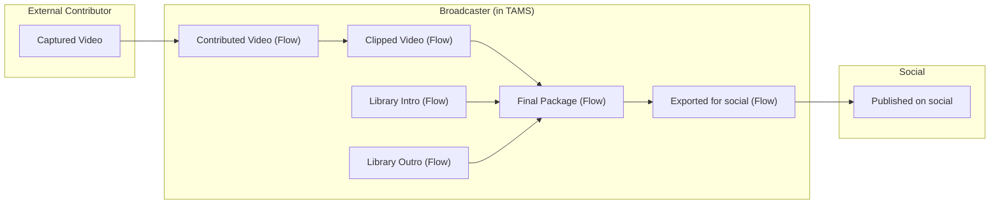
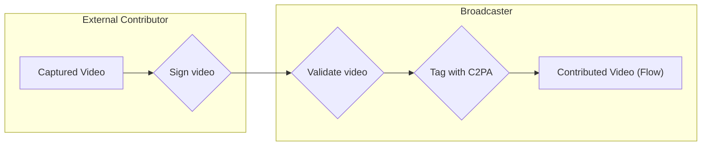
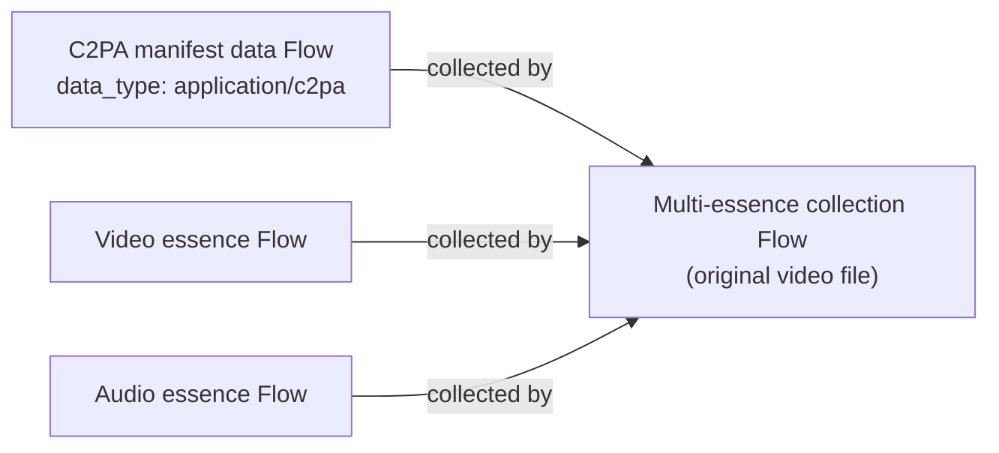
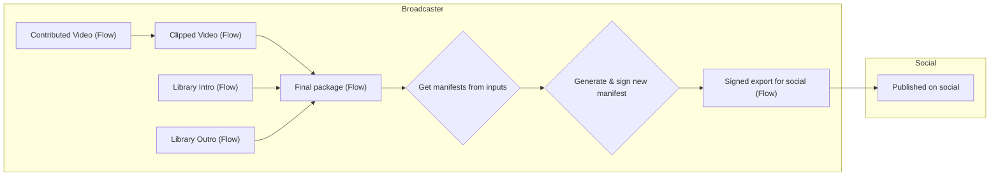
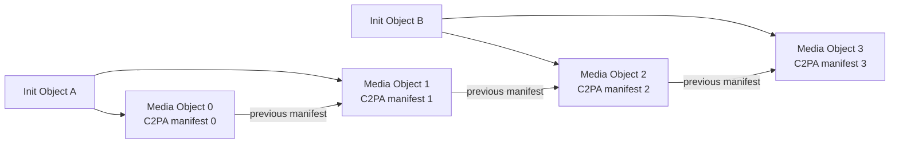

# 0011 C2PA provenance across related Sources and Flows

## Abstract

[C2PA](https://c2pa.org/), or "Content Credentials" is a metadata standard for authenticating the origin of media, and describing its provenance.
It uses certificates, cryptographic hashes, digital signatures and a tree of linked "ingredients" - links to the different versions of the assets used to create the current one.
However, as C2PA's hashing mechanism is intentionally brittle, and currently reliant on the container format, it is not obvious to imagine how to preserve provenance data across workflows involving TAMS.
Here we will examine some best practices for ingesting and exporting media from TAMS to allow clients to propagate and re-sign provenance without significant data loss.

This note is an initial recommendation on how to work with C2PA in TAMS for both file-based and live streams.
Implementors are encouraged to feedback and contribute to the recommendation as the workflows and standards develop.

## Trust Principles

One of the key features of C2PA is the description of the "action" taken when the ["hard binding"](https://c2pa.org/specifications/specifications/2.1/specs/C2PA_Specification.html#_hard_binding) (or hash) of content changes, which could be described as a new "version".
This action is important, as it can help differentiate a purely technical change, like repackaging, or transcoding for different bitrates, from more "editorial" ones, like cutting material or overlaying graphics.

TAMS is purely a media store, and has no concept of the type of action performed on content, nor does it perform any actions _itself_.

Instead, all actions are performed by clients of TAMS.
This leads us to our guiding principle for working with C2PA in TAMS: the generation of new C2PA manifests and the associated signatures should be done by TAMS clients, potentially using data stored in TAMS.

TAMS clients writing C2PA data will **need to assume responsibility for the data they write**, which means they will need to consider the broader workflow, including other clients involved in creating the media to be signed.

In situations where the workflow that produced that the Flows and Sources being used occurred outside of the organisation signing the C2PA asset, the signing organisation exposes itself to risk if the workflow turns out to be untrustworthy.
There are a number of ways to handle this, some options are:

1. The signing organisation doing an export asks the external organisations in the workflow to include a signed C2PA manifest with their output Flows and Sources
2. The signing organisation works out-of-band with the external organisations to establish their own expectations and trust, and then signs the whole workflow themselves, assuming all the risk
3. The signing organisation makes a decision to only sign workflows that are in their control, excluding workflows where external organisations are present

## File-based Workflow

Here's an example workflow to help us understand where C2PA validation and signing can happen.


```mermaid
  flowchart LR;
    subgraph ext[External Contributor]
      cap[Captured Video];
    end
    cap-->cont[Contributed Video #40;Flow#41;];
    subgraph broadcaster[Broadcaster #40;in TAMS#41;]
      cont-->clip[Clipped Video #40;Flow#41;];
      clip-->package[Final Package #40;Flow#41;];
      intro[Library Intro #40;Flow#41;]-->package;
      outro[Library Outro #40;Flow#41;]-->package;
      package-->exp[Exported for social #40;Flow#41;]
    end
    subgraph Social
      exp-->social[Published on social]
    end
```

Fig 1 - Example workflow

We will assume that the contributed video is an MP4 file including a C2PA manifest signed by the External Contributor (or by a device they own).

While out-of-scope for this application note, upon "accepting" this file, it is recommended for the broadcaster to validate the file before ingesting it into their TAMS store.
Validation checks that the signature and hash of the content are cryptographically correct (amongst other things), and also checks that the certificate that signed the manifest is also valid.
This last part can vary, depending on use case, but in the news industry, the certificate can be checked against the [IPTC's "Verified News Publisher" list](https://iptc.org/verified-news-publishers-list/), to ensure the identity of the signer is correct.

### Ingest

Once validated, the broadcaster should upload the contributed MP4 as-is into TAMS, as a single Segment.
This is done to ensure a modification-free record of the initial contribution, which preserves both the C2PA metadata, as well as its binding to the content, which, for a monolithic MP4 file, will be sensitive to any manipulation.


```mermaid
  flowchart LR;
    subgraph ext[External Contributor]
      cap[Captured Video]-->sign-cap{Sign video};
    end
    sign-cap-->validate{Validate video};
    subgraph broadcaster[Broadcaster]
      validate-->tag{Tag with C2PA}
      tag-->cont[Contributed Video #40;Flow#41;]
    end
```

Fig 2 - Ingest process

As part of that upload process, the multi-essence Flow being created should be tagged with `c2pa-provenance: embedded`, to ensure the provenance can be found later at export-time.

Alternatively, depending on workflow and performance constraints, the C2PA manifest can be copied out of the file, and subsequently uploaded to TAMS as a child collected data Flow, with a `role` of `c2pa`, and an `essence_parameters/data_type` value of `application/c2pa` and a `format` value of `urn:x-nmos:format:data`.
If this is done, the multi-essence Flow's tag should instead be `c2pa-provenance: detached`.


```mermaid
  flowchart LR;
    c2pa-data[C2PA manifest data Flow\ndata_type: application/c2pa]-- collected by -->parent[Multi-essence collection Flow\n#40;original video file#41;];
    video[Video essence Flow]-- collected by -->parent;
    audio[Audio essence Flow]-- collected by -->parent;
```

Fig 3 - Detached C2PA Flow example

### Editing

In the Figure 1 workflow, the broadcaster edits the contributed video to get it ready for publication on a social media platform.
The example shows two other contributions to the final asset: an intro and outro.
Depending on the level of C2PA adoption in an organisation, these assets may have C2PA provenance data attached themselves.
For this example, we will assume they don't.

The broadcaster continues to edit the package, potentially demuxing and segmenting the contributed video, as well as cutting to length, and combining it with the intro and outro videos.
In this process, no further C2PA-specific actions need to be taken, TAMS is used as-is.
However, there is an assumption that knowledge of the edit graph is captured and retained by something outside of TAMS - this might be a non-linear editor or MAM system.
This will be critical in the next step, where a package is readied for export, and C2PA provenance data is re-added.

### Export

When the broadcaster arrives at the point where they wish to download the final package ready for upload to a social media platform, they will need to perform a number of actions to assemble a new C2PA manifest for the packaged file.

First, the broadcaster should decide the granularity of provenance data they wish to include in the C2PA manifest that will be generated.
For this application note, we will consider a "coarse-grained" approach, where C2PA manifests are not generated for each intermediate step in the edit graph.
However, implementors are free to do so, in which case, they should follow the procedure below for each intermediate step.

The broadcaster (or more likely, the software package the broadcaster is using to interact with TAMS) should generate a graph of the edits performed in order to produce the final package.
They should make a list of the inputs to the final package (which, in this example, includes the contributed video and two-non C2PA videos: intro and outro), as well as the set of edits done (for example: cutting the contributed video, adding the intro and outro, repackaging/muxing, transcoding).
For each of the inputs, the Flow in TAMS should be interrogated to discover whether it has an existing C2PA manifest.

For mono-essence Flows, this can can done by following the `collected_by` relationship (found in the [Flow Details property on Flows](https://bbc.github.io/tams/5.1/index.html#/operations/GET_flows-flowId)) to its collector Flow, to get to the parent multi-essence Flow.

Once at a multi-essence Flow, the `c2pa-provenance` tag should be read to discover whether a C2PA manifests exists, and where it can be read from:

- No Tag: A C2PA manifest has not been identified in this Flow
- `none`: A C2PA manifest is not present inside this Flow
- `embedded`: A C2PA manifest is present inside this multi-essence Flow
- `detached`: A C2PA manifest has been copied from this multi-essence Flow into a collected mono-essence data Flow.
  The Flow will have the role `c2pa` in the multi-essence Flow's `flow_collection` array.

A C2PA manifest can then be constructed by converting inputs and edits into C2PA `ingredients` and `actions` respectively.
For each ingredient that had an available C2PA manifest, the whole C2PA manifest store for that ingredient should be added to the new C2PA manifest being generated.
This step will ensure that the input media with C2PA data is correctly linked so that the whole provenance chain is captured.

Depending on the use case, organisations may wish to include additional editorial metadata as a part of the assets manifest, which, if included, is securely bound to the content in the same way as the edit history.
Such metadata can include vocabularies from [Exif](https://www.cipa.jp/std/documents/download_e.html?DC-008-Translation-2023-E), [IPTC](https://www.iptc.org/std/photometadata/specification/IPTC-PhotoMetadata) and [Schema.org](https://schema.org/), using the [C2PA Metadata assertion mechanism](https://c2pa.org/specifications/specifications/2.1/specs/C2PA_Specification.html#_common_requirements).

Various libraries are now available to help implementors with manifest generation and signing, including the open-source [c2pa-rs](https://github.com/contentauth/c2pa-rs) library in Rust, for which other language bindings are available.

With the C2PA manifest and claim now generated, the manifest should be signed.
The actual certificate used will depend on the implementors use case and industry, but as mentioned previously, news organisations are able to use the Verified News Publisher certificates managed by IPTC, if they wish to sign as an organisation.

The resulting file can optionally be re-imported into TAMS as a multi-essence Flow, following the advice of the [Ingest section](#ingest).


```mermaid
  flowchart LR;
    subgraph broadcaster[Broadcaster]
      cont[Contributed Video #40;Flow#41;]-->clip[Clipped Video #40;Flow#41;];
      clip-->final[Final package #40;Flow#41;];
      intro[Library Intro #40;Flow#41;]-->final;
      outro[Library Outro #40;Flow#41;]-->final;
      final-->assembly{Get manifests from inputs};
      assembly-->manifest-gen{Generate & sign new manifest}
      manifest-gen-->exp[Signed export for social #40;Flow#41;]
    end
    subgraph Social
      exp-->social[Published on social]
    end
```

Fig 4 - Export / Publishing process

Finally, in our example workflow the file is published to a social media platform, which depending on their support, may render provenance user interface for users, allowing them to inspect the secure provenance history.

## Live Workflow

Live workflows require TAMS 8.2 or later, which supports Init Objects on Flow Segments. The current version of the C2PA specification applies to content packaged using the ISO BMFF standard (including CMAF). It does not support MPEG Transport Streams.

The C2PA specification defines two different methods for segment-based validation. This recommendation uses the 'Per-segment C2PA Manifest Box' method, described in [C2PA Section 19.3](https://spec.c2pa.org/specifications/specifications/2.4/specs/C2PA_Specification.html#using_c2pa_manifest_box). This choice minimises the creation of new init segments - over-use of init segments in TAMS workflows may result in un-needed re-initialisation of decoders which may adversely affect performance and/or playback. It is also straightforward to map to TAMS because every media segment is independently signed, at the cost of carrying a C2PA manifest in every segment.

We may consider adding a recommendation for the 'Verifiable Segment Info' method described in [C2PA Section 19.4](https://spec.c2pa.org/specifications/specifications/2.4/specs/C2PA_Specification.html#verifiable_segment_info) at a later date.

### Per-Segment Signing

For live video, every media segment should contain a C2PA Manifest Store in a top-level [C2PA `uuid` box](https://spec.c2pa.org/specifications/specifications/2.4/specs/C2PA_Specification.html#uuid_box). Its active manifest contains:

* A `c2pa.hash.bmff.v3` assertion that covers the bytes of that segment
  * Apply the C2PA BMFF exclusion rules, including exclusion of the C2PA `uuid` box itself
* A `c2pa.livevideo.segment` assertion
  * A monotonically increasing `sequenceNumber` that provides a unique identifier for the segment. Increasing by exactly one is recommended to simplify loss and replay detection
  * A `streamId` that provides a unique identifier for the entire video stream. This value can be any string that uniquely identifies the stream, such as a UUID. Persist an association between that value and the TAMS Flow
  * A `continuityMethod` which indicates the method used to ensure continuity between segments. This should be set to `c2pa.manifestId`
  * A `previousManifestId` set to the active C2PA manifest identifier of the preceding segment
* (optionally) Any other assertions relevant to that segment

An example `c2pa.livevideo.segment` :

```
{
  "sequenceNumber": 175,
  "streamId": "123e4567-e89b-12d3-a456-426614174000",
  "continuityMethod": "c2pa.manifestId",
  "previousManifestId": "urn:c2pa:F9168C5E-CEB2-4FAA-B6BF-329BF39FA1E4"
}
```

Signing must be the final operation that changes the media segment. Store and later validate the exact signed bytes; concatenating, remuxing or otherwise rewriting them creates a different C2PA asset.

### TAMS Representation

The corresponding TAMS representation is one mono-essence video Flow. Each signed media segment is stored unchanged as one Media Object and placed on the Flow timeline by one Flow Segment. The Flow Segment's `object_id` identifies the Media Object; C2PA continuity is carried inside the Media Objects and is independent of the TAMS timeline.

* `container` set to `video/mp4`
* `essence_parameters.init_segments` set to `true`
* each init segment stored as an Init Object
* each Flow Segment's `init_object_id` identifying the Init Object required to decode that media segment.
* the same Init Object ID reused until the required init bytes change

C2PA requires any init segment to contain its own C2PA `uuid` box, with a BMFF hash that includes the `moov` box to create a cryptographic relationship between the init segment and the media segments. Create a new Init Object when those init bytes change, for example because decoder configuration changes. C2PA claim-signer rotation alone does not require a new init segment.


```mermaid
flowchart LR
  initA[Init Object A]
  initB[Init Object B]
  seg0[Media Object 0<br/>C2PA manifest 0]
  seg1[Media Object 1<br/>C2PA manifest 1]
  seg2[Media Object 2<br/>C2PA manifest 2]
  seg3[Media Object 3<br/>C2PA manifest 3]
  initA --> seg0
  initA --> seg1
  initB --> seg2
  initB --> seg3
  seg0 -- previous manifest --> seg1
  seg1 -- previous manifest --> seg2
  seg2 -- previous manifest --> seg3
```

The solid arrows are TAMS references. The dotted arrow is the C2PA continuity link embedded in the next Media Object.

An Init Object change does not itself start or end a C2PA live stream. If the claim-signing certificate or signing service changes, continue the same `streamId`, sequence and `previousManifestId` chain, and validate the new signer under normal trust policy. A signer change is not a continuity break.

### Writing to TAMS

Follow this procedure, together with the general storage workflow in [Application Note 0024](https://github.com/bbc/tams/blob/main/docs/appnotes/0024-using-init-segments.md):

1. Create a mono-essence video Flow with `container: video/mp4` and tag it with `c2pa-provenance: embedded` as a discovery hint. Set `essence_parameters.init_segments` to `true`.
2. Start the C2PA signing state with a new `streamId`, initial sequence number and signer. 
3. C2PA-sign init segments, allocate storage and upload as Init Objects. Supply `content-type` during allocation only when required by the TAMS storage API, as described in Application Note 0024. Retain the returned Object ID.
4. For each media segment, generate and sign its final bytes, allocate a Media Object without overriding its content type, and upload those exact bytes using the allocated URL and content type.
5. Register one Flow Segment with the Media Object ID and exact Flow `timerange`. Include the current `init_object_id`.
6. Reuse that Init Object ID for subsequent Flow Segments. Upload and select a new Init Object before registering the first media segment that requires changed init bytes.

A simplified example Flow Segment registration:

```json
{
  "object_id": "media-object-id",
  "timerange": "[1700000000:0_1700000002:0)",
  "init_object_id": "init-object-id"
}
```

When `init_segments` is true, every media Flow Segment must identify an Init Object. A successful upload does not place an Object on the Flow timeline; the Flow Segment registration does that. Conversely, the registration and its timerange are TAMS metadata and are not authenticated by the embedded C2PA manifest.

### Reading and Validation

A reader validates three separate things: the TAMS representation, each C2PA asset, and continuity between C2PA assets. Validation is stateful even though every media Object is independently signed:

1. Request all Flow Segments covering the desired timerange, following TAMS pagination, and process them in ascending Flow timerange order.
2. Check Flow timeranges for gaps and overlaps according to application policy. When `init_object_id` changes, fetch that Init Object, validate its C2PA manifest and binding, and initialise the decoder before processing the referencing media segment.
3. Download each Media Object without concatenating, remuxing, or rewriting it. Apply normal C2PA manifest, signature, credential, assertion and `c2pa.hash.bmff.v3` validation to those exact bytes.
4. For each media segment after the first one observed, check that `streamId` is unchanged, `sequenceNumber` increases as required, and `previousManifestId` exactly matches the preceding media segment's active manifest identifier.
5. Report TAMS mapping, C2PA validity, C2PA continuity and signer trust separately. A correctly signed Object can be on the wrong TAMS timerange, and a valid signature from an untrusted credential is not a trusted result.

A media segment may have a valid signature and hard binding while continuity from the intended start of the stream is unproven. This occurs, for example, when validation begins mid-stream and the predecessor is unavailable. The reader should report the segment-level result and the chain-anchoring result separately.

Once a validation failure occurs in a linear playback session, later valid segments do not erase it. The client should retain and expose the failure until an explicit discontinuity, seek, or new validation session establishes a new policy boundary.

### Long-Running Flows

The recommendations in [Application Note 0010](https://github.com/bbc/tams/blob/main/docs/appnotes/0010-long-running-sources-and-flows.md) apply to live C2PA Flows. A validator that follows a growing Flow should persist at least:

* the Flow ID and last validated timerange
* the `streamId` and last accepted `sequenceNumber`
* the last active manifest identifier
* the current Init Object ID
* the signer and trust result needed by local policy

On restart, recover enough preceding state to validate the next segment's predecessor link. If that state cannot be recovered, report an unanchored restart instead of inventing continuity. Handle pagination, retention windows, late registration, duplicate delivery, and concurrent reads explicitly.

For an intentionally never-ending service, operational policy also needs to cover certificate renewal, revocation checks, time-stamping, monitoring, checkpoint durability, and what constitutes an announced discontinuity. These are deployment concerns beyond merely passing the C2PA wire-format checks.

## Implementation Evidence and Limits

The live recommendation was exercised in an experimental implementation using CMAF-compatible H.264 video, the C2PA Rust SDK implementation from experimental pull request 2562 pinned at commit `8d44625e23794491b312b3984ec49a1b58234a62`, and a TAMS 8.2 service.

This evidence is sufficient for the scoped informative recommendation, but it is not a production interoperability claim. The following remain future work:

* audio and muxed multi-track media
* adaptive bitrate ladders and switching between renditions
* the Section 19.4 Verifiable Segment Info and session-key method

## References

* [C2PA Technical Specification, Section 19: Live Video](https://spec.c2pa.org/specifications/specifications/2.4/specs/C2PA_Specification.html#live-video)
* [TAMS Application Note 0003: Tag names](https://github.com/bbc/tams/blob/main/docs/appnotes/0003-tag-names.md)
* [TAMS Application Note 0010: Long-running Sources and Flows](https://github.com/bbc/tams/blob/main/docs/appnotes/0010-long-running-sources-and-flows.md)
* [TAMS Application Note 0021: Media integrity](https://github.com/bbc/tams/blob/main/docs/appnotes/0021-media-integrity.md)
* [TAMS Application Note 0024: Using media with initialisation segments](https://github.com/bbc/tams/blob/main/docs/appnotes/0024-using-init-segments.md)
* [TAMS API documentation](https://bbc.github.io/tams/main/)