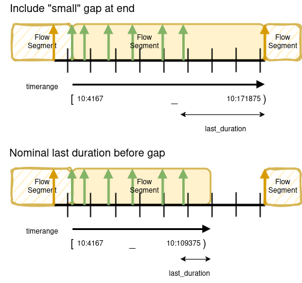

# Using Flow Segment TimeRanges

This application note explains the usage of the Flow Segment `timerange` property, starting with a short primer on Timestamps and TimeRanges.

## A Short Primer on Timestamps and TimeRanges

> Note: video frames and audio samples and data items are all referred to as `samples` in this document (and the specification).
> The word `sample` is intended to broadly denote something that was sampled at a point in time.

### What is a Timestamp

A Timestamp is a time value on a Timeline.
The Timeline may be associated with a Flow, Source, a group of Flows or Sources.

The Timestamps are ordered by time.

A Timestamp is measured in linear time units on the Timeline.
E.g.

- Time units that are not directly related to the sample rate
  - E.g 1/1000000000 (nanoseconds) and 1/90000.
- Time units that are directly related to the sample rate
  - E.g. equal to the sample duration.
    1/50 and 1001/30000 video and 1/48000 audio sample durations.
  - E.g. equal to the denominator part of a fractional sample duration.
    1/30000 for a 30000/1001 video sample rate.

The Timeline has an zero point (the epoch) from which Timestamps are measured.
The Timestamp at the zero point has a zero time value and Timestamps before the zero point are negative.

TAMS uses Timestamps with a nanosecond resolution time unit.

### Timestamp Representation in the TAMS API

The TAMS API uses a string representation for Timestamps which is described in [Timestamps in TAMS - Timestamp Representation](./0008-timestamps-in-TAMS.md#timestamp-representation).

### What is a Sample Timestamp

A sample is a frame of video, a sample of audio or a data item like a subtitle.

A sample Timestamp is an approximation of the time a sample is "active" on the Timeline.
The sample Timestamps may simply represent the order of samples on the Timeline and may not be an accurate representation of the time the sample was captured or presented.

A Timestamp is a label for the sample that is distinguishable from all other Timestamp labels assigned to other samples in the same Flow.

A Timestamp is an abstraction of the timing characteristics of the sample that is captured or presented.
The sample in reality may have an instantaneous time period, it may cover a given constant or variable time period, it may change over a time period.

A Timestamp is generally taken to be the start of the sample on the timeline.

A Timestamp does not specify the sample duration on the timeline.

### What is a TimeRange

A TimeRange is a time period on a Timeline.
The time period may be zero, finite or infinite.

The start and end of a TimeRange is represented using a Timestamp if it does not extend to infinity.
A TimeRange may extend to negative infinity or positive infinity.

A TimeRange may be instantaneous with a zero duration, i.e. the TimeRange is a Timestamp.

A TimeRange may be empty, i.e. have a zero duration and not overlap with any time values on the Timeline.

The extents of the TimeRange may be defined as inclusive or exclusive.
An inclusive Timestamp start or end means that the given Timestamp is the first or last Timestamp included in the time period.
An exclusive Timestamp start means the Timestamp is not included in the time period but the Timestamp after that is.
Similarly, for an exclusive end Timestamp, it is not included but the Timestamp before that is.

A TimeRange may express the existence of samples for a time period.
A TimeRange may be used to query for samples for a time period.
The types of TimeRanges that express the existence of samples may be more limited than the types of TimeRanges that are used to query with.
E.g. samples don't generally exist into infinity but a query could use infinity to apply no limits.
A query may want to target a time period after a certain Timestamp, which results in an exclusive start Timestamp in the query TimeRange.
A query may use Timestamps that are positioned near sample Timestamps but not precisely equaling them.

### TimeRange Representation in the TAMS API

The TAMS API uses a string representation for TimeRanges which is described in [Timestamps in TAMS - TimeRange Representation](./0008-timestamps-in-TAMS.md#timerange-representation).

### What is a Sample TimeRange

A TimeRange may be represented by the first sample Timestamp as the inclusive start and the last sample Timestamp as the inclusive end.

Samples may have a duration and in that case the duration is included in the TimeRange.
The TimeRange then starts with the first sample's Timestamp and (exclusive) ends before the last sample Timestamp plus duration.

## Setting Flow Segment TimeRanges

The Flow Segment `timerange` is the TimeRange of samples contained in the Flow Segment on the Flow Timeline.
The Flow Segment `ts_offset` specifies the time shift to be applied to the sample Timestamps on the media container Timeline.
After applying `ts_offset` the TimeRange of the samples equals the value of Flow Segment `timerange`.

The Flow Segment `timerange` start is inclusive and is the Timestamp of the first sample contained in the Flow Segment.
If the samples have a duration then the `timerange` end is exclusive and is the last sample Timestamp plus duration.
If the samples don't have a duration then the `timerange` end is the last sample Timestamp and is inclusive.

The Flow Segment `last_duration` property is set to the difference between the `timerange` end and the last sample Timestamp.
Setting it allows a reader to calculate the last sample Timestamp.
The `last_duration` may not be equal to the nominal sample duration calculated from the constant sample rate.

### Timestamps Regularised Or Not

The [Timestamps in TAMS](./0008-timestamps-in-TAMS.md) Application Note explains what Timestamp regularisation is.

If Timestamps include phase offsets and jitter that record how samples were produced by a transmission encoder for example, then that complicates the task of TAMS clients that don't care about the originating realtime transmission chain and instead care about the media timing relationships and where there are gaps.

If the Timestamps are not regularised then clients will need to handle the variance in Timestamps when querying and perform the regularisation process that is needed for "clean" timing.

If samples have a constant rate and the Timestamps are regularised then the `timerange` ends with the next Flow Segment's sample Timestamp and the `last_duration` equals the nominal sample duration if set.

If the samples don't have a constant rate or the Timestamps are not regularised then the `timerange` also ends at next Flow Segment's sample Timestamp but the `last_duration` may not be equal to the nominal sample duration.

### Gaps and Flow Ends

The Flow Segment `timerange` may also extend past the idealised sample durations when there are gaps that are not considered to be an error condition.

Note that a Flow Segment can have gaps within it and creators of Flow Segments need to decide whether a gap at the end of a Flow Segment need to be included or exposed.

Including the gap in the Flow Segment means extending the `timerange` to the next Flow Segment's first sample Timestamp.
The `last_duration` is set to the difference between the `timerange` end and the last sample Timestamp.

If the gap needs to be exposed then the Flow Segment creator can set the end of the `timerange` to the last sample Timestamp plus the nominal sample duration.
If the sample rate is variable but based on a fixed rate with dropped samples then use the fixed rate to set the duration.
If the sample rate is variable then the Flow Segment creator should decide on an appropriate value such as the average sample duration.
The `last_duration` is set to the difference between the `timerange` end and the last sample Timestamp.

## Querying Flow TimeRanges

The TAMS will include the sample duration in the calculation that decides which Flow Segments to return in TAMS API TimeRange query results.

The query results may include an additional Flow Segment to what the client expects if the query TimeRange starts after the last sample in a Flow Segment.
The client can decide that the time period in the Flow Segment is essentially a gap or insufficiently covers the duration of the last sample and not use the Flow Segment.

The Flow Segment `last_duration` can be used by clients that need to know the Timestamp of the last sample in a Flow Segment.

If the Timestamps are not regularised then the client needs to include additional time margins to the query TimeRange.
The client also need to decide the threshold for filtering out Flow Segments, e.g. decide what the regularised Timestamps should be.

The media container is the ultimate source of timing information (after adjustment using `ts_offset`).
If the Flow Segment is missing timing information then it could be extracted from the media container.
However, this should be avoided and timing information in the Flow Segment should be as complete as possible.
