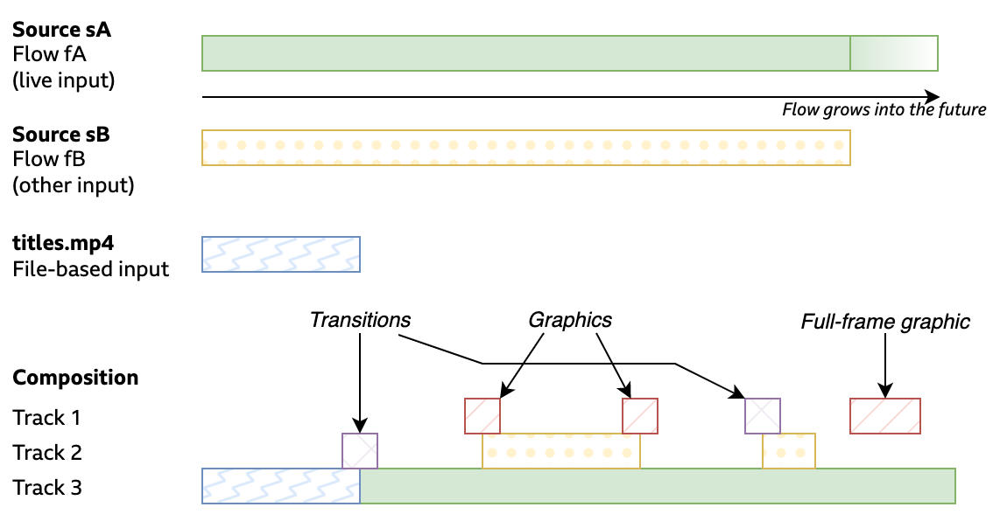
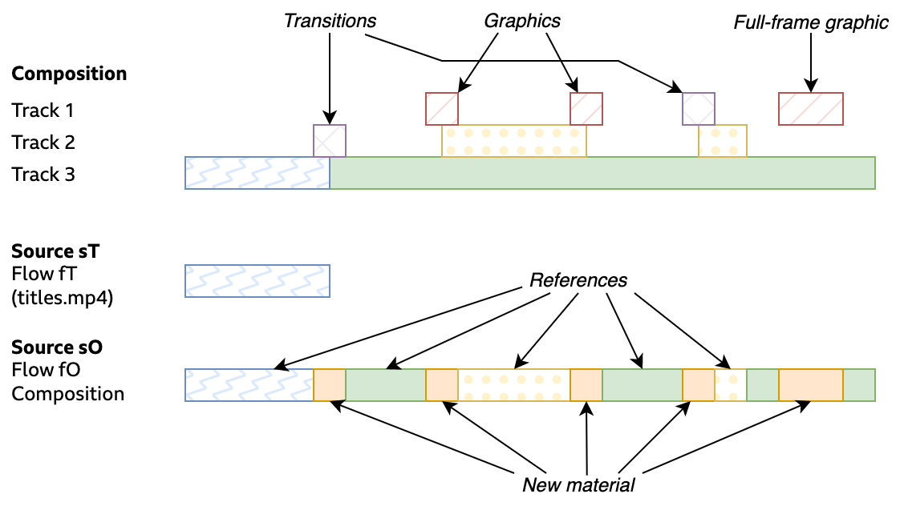

# 0015: Using TAMS in OpenTimelineIO

## Abstract

TAMS provides limited options for re-using content across multiple Sources, however many workflows will require more complex descriptions of compositions and editorial operations.
Providing a composition description format is beyond the scope of TAMS, however it can interoperate with other formats, such as [OpenTimelineIO](https://github.com/AcademySoftwareFoundation/OpenTimelineIO).
This Application Note describes how TAMS content could be referenced in an OpenTimelineIO composition.

## Background

OpenTimelineIO (or OTIO) provides a data model to describe compositions.
It is intended to be an open, extensible model, which can be used by a variety of workflows through a number of tools (such as common NLEs).

OTIO is deliberately flexible to how the underlying media is referenced, which makes using asset management solutions and relinking compositions as they move between systems easier.
The same approach could be applied to reference media in a TAMS store.
The advantages of using TAMS with OTIO are that it provides a way to describe complex compositions _by reference_ in an open, machine-readable form, which works in conjunction with the TAMS timing and data model.

Describing the OTIO data model is beyond the scope of this document, however an approach is described to allow an OTIO [Clip](https://sandflow.github.io/otio-core-specification/#object-model-Clip) to refer to media in a TAMS instance.
For further detail on the OpenTimelineIO data model, review the [timeline structure documentation](https://opentimelineio.readthedocs.io/en/stable/tutorials/otio-timeline-structure.html), [Application Integrator's Guide](https://github.com/AcademySoftwareFoundation/OpenTimelineIO/wiki/OpenTimelineIO-Application-Integrator's-Guide) and [model documentation](https://sandflow.github.io/otio-core-specification/#object-model-Track).

## Referencing Content

Ideally, compositions should be described in terms of [Sources](../../README.md#sources), which decouples editorial composition intent from the technical details of underlying media.
When a tool needs to show those Sources to a user, it should link them to appropriate Flows, making suitable selections among the Flows available.
OpenTimelineIO has the ability to apply more than one `MediaReference` for a Clip, so tools such as NLEs could also offer multiple Flows and allow the user to choose between them, for example choosing between proxy and full-quality content.

OTIO provides two types of `MediaReference` that are relevant to TAMS:

- A [`MissingReference`](https://sandflow.github.io/otio-core-specification/#object-model-MissingReference) refers to a piece of media for which there is no concrete reference, for example a Source ID in TAMS.
  This type is explictly intended to be re-linked by a tool to an appropriate more concrete reference.
- An [`ExternalReference`](https://sandflow.github.io/otio-core-specification/#object-model-ExternalReference) refers to a concrete piece of media by URI, such as a Flow on a TAMS instance.

These references can be used with some of the reference formats proposed in [AppNote 0014 - Referencing TAMS Content in other systems](./0014-referencing-tams-content-in-other-systems.md) to refer to TAMS content in compositions.

### MissingReference Format

This format uses metadata to reference a Source ID in TAMS.
In this example the reference is a `MissingReference`: no specific location is given for the media (since a Source has no concrete location).
A client with access to a suitable TAMS instance could use a [Media Linker](https://opentimelineio.readthedocs.io/en/latest/tutorials/write-a-media-linker.html) plugin to read the `metadata` dictionary and locate the Source, and then select suitable a subset of Flows.

Once linked, an `ExternalReference` with a `target_url` could be constructed and used for each Flow as below (with some suitable mechanism used to set the `active_media_reference_key`), which retains the same `metadata` dictionary.
In principle the `metadata` [should be preserved](https://github.com/AcademySoftwareFoundation/OpenTimelineIO/wiki/OpenTimelineIO-Application-Integrator's-Guide#preserve-metadata-to-the-best-of-your-abilities) so even if the `target_url` is replaced with a file on disk, it should still be possible to reconstruct the TAMS reference.

The `start_time` and `duration` in the `available_range` are Flow timestamps with nanosecond precision, referring to the timerange over which the Flow is available.
The `source_range` also has a `start_time` as a nanosecond timestamp within the same Flow.

```json
"media_references": {
    "DEFAULT_MEDIA": {
        "OTIO_SCHEMA": "MissingReference.1",
        "metadata": {
            "bbc.github.io/tams": {
                "source_id": "9bb414a5-862c-494f-86ce-8e2720ecc315",
                "available_range_offset": "0:0"
            }
        },
        "name": "camera-one.ts",
        "available_range": {
            "OTIO_SCHEMA": "TimeRange.1",
            "duration": {
                "OTIO_SCHEMA": "RationalTime.1",
                "rate": 1000000000.0,
                "value": 372100000000.0
            },
            "start_time": {
                "OTIO_SCHEMA": "RationalTime.1",
                "rate": 1000000000.0,
                "value": 1723124086620000000
            }
        },
        "available_image_bounds": null
    }
}
```

Note the presence of an `available_range_offset` that describes how the `available_range` here maps onto the Flow timeline, much as `ts_offset` remaps media essence timing to Flow timing.

### ExternalReference Format

This format refers to a URL in a TAMS instance and points to a specific, concrete Flow.
It is possible a Clip could have more than one `ExternalReference` object (e.g. for each Flow), with the appropriate default selected: this allows, for example, online and proxy workflows to be presented in a UI.

Notice that the URL has a prefix `tamss://` (for "TAMS Secure" - `tams://` would also work for HTTP).

```json
{
    "OTIO_SCHEMA": "Clip.2",
    "metadata": {},
    "name": "camera-one.ts",
    "source_range": {
        "OTIO_SCHEMA": "TimeRange.1",
        "duration": {
            "OTIO_SCHEMA": "RationalTime.1",
            "rate": 50.0,
            "value": 111.0
        },
        "start_time": {
            "OTIO_SCHEMA": "RationalTime.1",
            "rate": 1000000000.0,
            "value": 1723124225400000000.0
        }
    },
    "effects": [],
    "markers": [],
    "enabled": true,
    "media_references": {
        "DEFAULT_MEDIA": {
            "OTIO_SCHEMA": "ExternalReference.1",
            "metadata": {},
            "name": "camera-one.ts",
            "available_range": {
                "OTIO_SCHEMA": "TimeRange.1",
                "duration": {
                    "OTIO_SCHEMA": "RationalTime.1",
                    "rate": 1000000000.0,
                    "value": 372100000000.0
                },
                "start_time": {
                    "OTIO_SCHEMA": "RationalTime.1",
                    "rate": 1000000000.0,
                    "value": 1723124086620000000
                }
            },
            "available_image_bounds": null,
            "target_url": "tamss://tams.example.com/flows/9bb414a5-862c-494f-86ce-8e2720ecc315"
        }
    },
    "active_media_reference_key": "DEFAULT_MEDIA"
}
```

To make use of this format, a tool should either use its native TAMS integration to contact the store and fetch the content, or alternatively a Media Linker could be written to download the relevant content to a file (and then another tool used to remap back to references in the store).

## Rendering back to TAMS

TAMS has a basic mechanism for re-using essence in multiple places on multiple Flow timelines, as described in the [Flow and Media Timelines section](../../README.md#flow-and-media-timelines) of the top-level README.
When a composition is rendered by a tool, this mechanism could be used to make the render process faster and more storage efficient, by identifying areas that can be re-used, while writing new Flow Segments for areas that cannot.

For example, consider a pair of clips (Sources) and a timeline built out of them, with a number of graphics and transitions applied as well.
Internally, this timeline is represented as a data structure describing clips and effects, for example stored in an OpenTimelineIO composition.



Clearly the result of rendering this timeline is a new Source and Flow, and it could be rendered in the usual way, producing new essence that is written to the store.
However, it could also be rendered by identifying areas of the timeline that copy the inputs directly, and creating Flow references instead.
In the diagram below Source/Flow `sO/fO` have been created as the output, containing a mix of references to inputs, and new material where references are not possible.



This makes the render process faster (references are a very "cheap" metadata operation), makes more efficient use of storage, and avoids an additional decode-encode cycle on some of the content.
Having both the new material and the rendered output in the store also allows other tools and systems to consume that output; systems that may not be able to work with the EDL directly, but can readily utilise the reference-rendered output.

In the diagram above, some of the non-TAMS content in the original timeline (`titles.mp4`) has also been written to the store as an independent Flow, and referenced as well.
It is also possible to write those as new content in the output (as is done with the full-frame graphic), however writing independent Flows may be advantageous to unify workflows with TAMS, reducing the scope and complexity of other workflows.

In practice it may be valuable to store both an OpenTimelineIO composition referring to the timeline, and also a Flow rendered in this manner.
The composition provides the ability to continue editing and produce new versions, and opens up new metadata workflows where the original Sources can be identified.
Meanwhile the rendered Flow allows the tool that produced it (e.g. an NLE) to continue to use it's own effects, graphics and processing capabilities without requring that the composition format (e.g. OTIO) and TAMS understand them.

As part of this, the render and composition should be linked together, by referring to the location of the composition (e.g. a MAM reference) in tags for the rendered Flow, and including a metadata dict in the composition Timeline object:

```json
{
    "metadata": {
        "bbc.github.io/tams": {
            "rendered_source_id": "ff142171-708f-4ae2-8446-443012abb271"
        }
    }
}
```

Note that if doing so, if the composition is changed, the Source ID must change as well.
