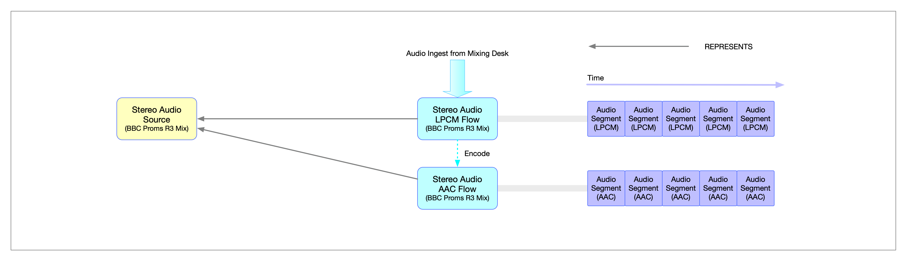

# 0017 - When to reuse IDs

## Abstract

The TAMS data model makes use of strong timing and identity, compatible with the [JT-NM Reference Architecture](https://www.jt-nm.org/reference-architecture) and [NMOS IS-04](https://specs.amwa.tv/is-04/releases/v1.3.3/docs/Data_Model_-_Identifier_Mapping.html), to enable re-use of content throughout production workflows.
This Application Note provides guidance on when identities should be re-used, and when new IDs may be needed.
It assumes basic knowledge of the [TAMS Content Model](https://github.com/bbc/tams/blob/main/docs/appnotes/0001-multi-mono-essence-flows-sources.md).

## The Identity Data Model

The basic principle for identity in TAMS is that if content is identical in media and timing it should, in an ideal world, have the same identity.
This applies to both content within a single TAMS store, between multiple TAMS stores, and between TAMS and other compatible systems such as NMOS.

Let's unpack this further.

If two media Objects are bit-identical, they should be the same Object and use the same Object ID.
That is to say the same Object should be re-used where possible, and not duplicated.
Implementations may serve the same Object from multiple locations (i.e. via `get_urls` on Flow Segments which use the Object), but the content at all of these locations should be identical.

> [!IMPORTANT]
> It is not currently possible to maintain Object IDs when transferring media between TAMS instances.
> This is because a new Object must be created on the destination store, and this will create a new Object ID.
> It is, however, possible to re-use Object IDs when referencing media held in external storage in another TAMS.

If two Flows have identical data (i.e. Objects) at the same Timestamps, they should be the same Flow and use the same Flow ID and, by extension, the same Source ID.
That is to say the same Flow should be re-used where possible, and not duplicated.

If two Flows are editorially identical, but not technically identical (i.e. are different in technical characteristics alone) they are different Flows but the same Source.
They should have the same Source ID but different Flow IDs.

If two Flows are technically identical but are timeshifted, they are different Flows with different Flow IDs and different Source IDs.
They may, however, re-use the same Objects using the Segments layer of the data model to map them to the two Flow's different timelines.

If two (or more) Flows are editorially different but re-use technically identical sections (i.e. basic edits), they are different Flows with different Flow IDs and different Source IDs.
But they may re-use some of the same Objects using the Segments layer of the data model to map them to the Flow's different timelines.
This is termed "edit by reference".

## Interactions With Other Systems

When a TAMS system is interacting with other systems with a compatible identity model (e.g. NMOS/2110), we can expand these principles to provide best practice for those interactions.

If a Flow is ingested from, or outgested to a non-TAMS system and remains technically identical with no time-shift it should be the same Flow and should maintain it's Flow and Source ID (and Object IDs, where appropriate).

If a Flow is ingested from, or outgested to a non-TAMS system and remains editorially identical with no timeshift, but not technically identical, it should be the same Source and should maintain it's Source ID but have different Flow IDs.

If a Flow passes from one system "A" to another system "B" and back to system "A", the Flow and its metadata should be identical at both points in system "A".

It is worth noting that Objects are a TAMS concept.
While they are somewhat analogous to Grains in NMOS, there is no requirement for them to map directly.
The important aspect is the ability of Flows to pass through multiple systems transparently.

## Real-world Implications

It should also be acknowledged that the real world is messy and it might not be possible to meet these recommendations at all times.
Consider where the same media is ingested into two separate systems simultaneously.
Ideally, these ingestors should be configured by the same coordinating system to have the same IDs.
Indeed, dual redundant ingest systems should work in this way.
But there may be cases where such parallel ingests are in entirely separate systems.

### Avoiding Duplication

Systems may wish to present a list of existing Sources/Flows on setup in such a way that users could identify the content which is being duplicated and either re-use the existing copy (avoiding an un-needed ingest), or ingest with the existing identifiers.

Note that systems probably shouldn't present the bare UUIDs to the user, they aren't intended to be human readable and will likely provide a bad experience.
Systems should also avoid revealing the complex technical metadata of flows to users.
Systems should ideally present users with the human readable Source Label and Description to enable them to identify matching Sources (i.e. content which matches editorially).
Ideally, systems should then identify if there is a matching Flow automatically (i.e. a technical match).

It is important to remember that what is most important to users is high level concepts such as editorial matches.
A subset of users will be concerned about high level technical details like if content is proxy or mezzanine quality.
Many users will not, and probably should not, care about precise technical matches.
In most cases, systems and not users should be concerned with ensuring the availability of a full quality ladder where required.

In some cases, matching Flows may be identified by checking the technical metadata of the Flow.
Implementations should take care using this approach where Flows may have originated from different implementations as different codecs may produce different output for the same media and the same technical parameters.
Implementations could verify matches by inspecting the media itself, though this method will be inefficient and likely doesn't make sense in most cases.

### De-duplication

Where two completely independent systems ingest the same content but assign different IDs, it maybe desirable to link, or re-key the two Flows.

Linking the Sources/Flows but keeping them in place is arguably least disruptive, but is not ideal.
The means of linking identical Flows in TAMS is via a shared Source ID.
As such, there is no method in TAMS to indicate that two Sources are identical as this would essentially duplicate the intended functionality of Sources.
Such a relationship would need to be managed via another system.
But by storing that relationship to another system introduces a barrier to discovering content and re-use of it.

The intended way of linking duplicate media in TAMS is via a shared Source ID.
It is possible to update the Source ID on an existing Flow, but this should be avoided.
The link between a Flow and a Source is generally assumed to be static and unchanging.
Changing of the Source ID of a Flow could lead to un-intended consequences arising from discrepancies between systems that haven't picked up this partial change in identity.
Changing of the Source ID of a Flow should only carried out as a last resort where the consequences are fully understood and mitigated.

An option less likely to run into these discrepancies is the full re-keying of a Flow.
That is, the creation of a new Flow ID (if required) that makes use of the intended Source ID, and that references the existing Objects.
This can be thought of as using the zero-transfer re-use mechanism of TAMS to correct the IDs.
If an appropriate Flow ID already exists and should be re-used, systems should determine if it is appropriate to add references to the duplicate Objects to the segments which exist on the "destination" Flow.
This may be appropriate if the Objects are in backing storage at different logical/geographical locations.
It may also be appropriate to reference only some of the objects if they fill in gaps in the destination Flow.
Systems should then determine weather to delete the duplicate Flow.
This decision should be made based on the likelihood of impact to other systems that the delete may cause.
Systems should also consider the resource implications of persisting the duplicate flow.
If all of the segments are shared between the Flows, the resource impact may only be at the metadata level and may not justify potential disruption.
If the potential disruption of deleting the duplicate Flow is little/none, it should probably be deleted.

It should be re-iterated that the best approach to content duplication is to avoid it all together.
Duplication makes effective re-use of content harder.
And it is likely an inefficient use of resources.

### Use-cases For Duplication

While we heavily discourage duplication of media under different Source and Flow IDs where at all possible, there a small number of cases where it is appropriate.

#### Clipping

Where a clip is to be created from a section of a Flow, the clip may be the same Flow ID and same Source ID if the clip can be represented by an external system.
That is to say, a system could represent a clip via a Source/Flow ID and a TimeRange.
Alternatively, a new Flow may be created that re-uses the required Objects.
If the clip is time-shifted, it will always be a different Flow with a different Flow ID and different Source ID.
Whether clips are represented as Flows within TAMS or external to TAMS will be dependent on the need for re-use, and the scalability implication of the increased number of Flow/Source IDs for a given use-case/deployment.

#### Authorization

Where authorisation is provided at the Flow level (e.g. by using the mechanism described in ADR-0028/AppNote-0016) new "clip" Flows may be created to provide access to a subsection of an existing Flow only.
These new flows, by necessity, will have new Flow IDs and Source IDs.
They may, and for efficiency purposes probably should, use the same media Objects where possible.
It should be noted that Objects may contain more than one frame/sample's worth of media.
As such, care should be taken where access to content around clip edges is sensitive and new Objects created to remove the sensitive content as required.
