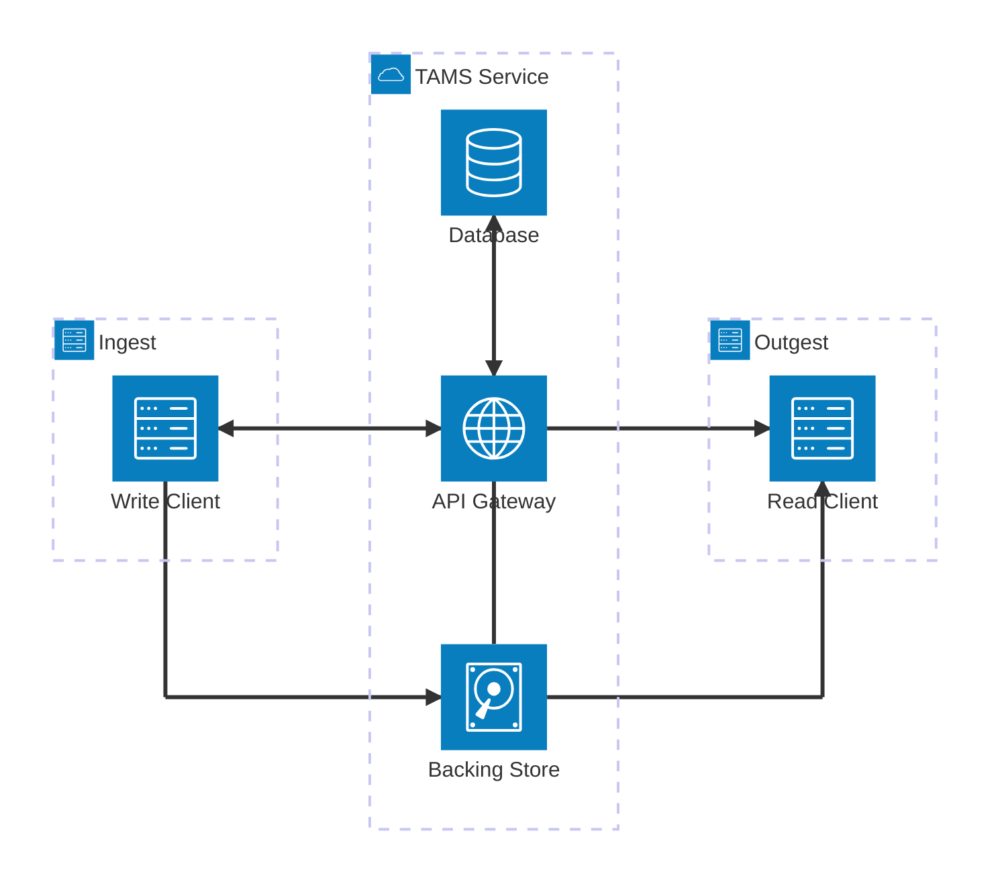
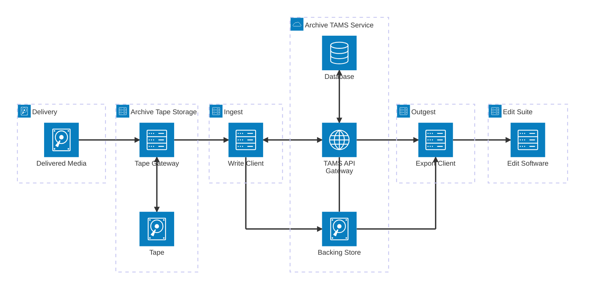
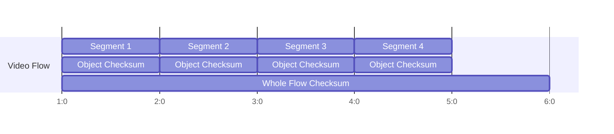
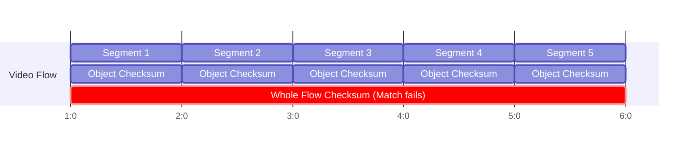
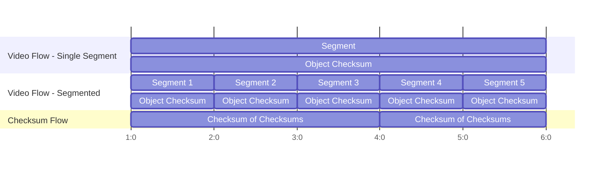
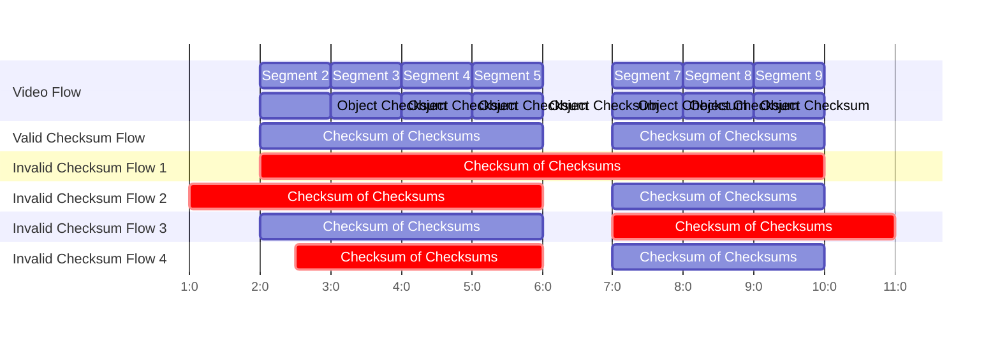

# AppNote0021 - Integrity model for media in TAMS, and when interacting with other systems

## Abstract

When using TAMS for archiving of content, or when TAMS interacts with other archive systems, ensuring integrity of media is of particularly high priority with different considerations to short and medium term applications.
This Application Note discusses approaches to ensuring the integrity of media in TAMS in various environments.

## TAMS Architecture

A TAMS Service, and associated workflow will often be architect as follows.
A write client originates media (how is not important at this point).
It registers a Flow with the TAMS Service.
Then requests the allocation of a number of Objects and associated PUT URLs.
Uploads media to those Objects (directly to the storage backend).
And registers them against the Flow via Flow Segments.
A read client queries to find the Flow it requires.
Requests the Flow's Segments, with their associated Object GET URLs.
It the retrieves the Objects and assembles them in sequence for use.



## Basic Integrity Model

The architecture above gives a number of distinct points under the direct influence of the TAMS specification where data loss or corruption could occur:

1. Transfer of media over the internet
2. Metadata transferred over the internet
3. Media stored on disk in the TAMS Service
4. Metadata stored in the TAMS Service's database

### HTTPS/TCP Reliability

For points 1 and 2, we should look to the reliability of HTTPS/TCP.

Fitzgerald, Jack, et al[^1] attempted to experimentally test the likelihood of undetected packet errors in TCP.
This was carried out by transferring files between a NAS and multiple clients.
The experiment used a custom protocol to allow them to verify the packets.
This protocol involved small control messages to request a file and then the transfer of gigabyte files.
After transferring 26PB data, ten TCP messages had failures undetected by the TCP checksum.
All were control messages, which account for 0.0001% of data.
Their hypothesis is they’re seeing bugs somewhere in the chain the only presented at the start of the connection.
As this experiment only used TCP and not HTTPS, it would miss the additional layer of protection/detection that TLS/SSL would provide.

[^1]: `Fitzgerald, Jack, et al. "Looking for errors tcp misses." NOMS 2025-2025 IEEE Network Operations and Management Symposium. IEEE, 2025.`

Pápay, Ladislav, et al[^2] describes a large scale file transfer system.
In section 6.2 it discusses error rates and their causes.
After transferring 130EB data, 1742 damaged blocks as detected by checksum errors were identified.
909 of these were due to a single machine on a single day.
On average without outliers, they expect 4.55 corruptions per EB (13.31 corruptions if they include the outliers).

> [!NOTE]
> These are corruptions detectable by checksums.
Undetectable errors are possible but extremely low probability and would not meaningfully increase this figure.

[^2]: `Pápay, Ladislav, et al. "An exabyte a day: throughput-oriented, large scale, managed data transfers with Effingo." Proceedings of the ACM SIGCOMM 2024 Conference. 2024.`

For reference, 1EB of data is significantly larger than the size of the BBC's entire digital archive, and likely that of other broadcasters.
It is probable that this entire archived could be transferred and never see a single checksum error.
Where detectable checksum errors did occur, they should result in a re-transmit of the packet.
The likelihood of an TCP checksum collision is `1/2**16`.
Undetectable corruptions are so unlikely to occur that the probability can be considered negligible.

It is also worth noting that TCP initially sends the amount of data a connection intends to transmit.
If a packet in the middle of the transmission is lost, there will be a missing sequence number allowing the lost packet to be detected.
If the last packet is lost, the amount of data received doesn’t match the amount of data communicated.
The packet loss will then be detected and a re-transmit can happen or the upload can be signalled as failed.

In summary, the likelihood of undetected packed loss during HTTPS/TCP transmission is incredibly unlikely.
The mechanisms to detect loss or corruption of packets are so effective that they can be considered more than sufficient in most basic TAMS use cases.

### Object Storage

Major cloud providers generally state an annual durability of object storage of 99.999999999% a.k.a 11-nines (e.g. [AWS](https://docs.aws.amazon.com/AmazonS3/latest/userguide/DataDurability.html), [Google Cloud](https://docs.cloud.google.com/storage/docs/availability-durability), [Azure](https://learn.microsoft.com/en-us/azure/storage/common/storage-redundancy)).
This is achieved by storing multiple copies, in multiple zones, and using checksums to regularly validate these.

While “durability” isn’t defined, we’ll assume that this can be interpreted as the probability of the effective loss/corruption of any given Object from the point at which it is received by the cloud provider to the point at which they may send it back to us.
To put this another way.
We can expect a >50% chance that any given object will be lost after 70billion years - An order of magnitude greater than the age of Earth.
For the age of the earth, there’s a mere 4.5% chance of loss…

It is also likely that “durability” here refers to the actual loss of data.
The probability of undetectable loss will be even smaller.
As an example, the probability of a collision on the default CRC64 hash calculated by AWS' S3 is 1/2\*\*64, or 5.4e-20.

#### Worked examples

> [!WARNING]
> This section is going to miss-use the above durability value as if it is a genuine probability of Object loss.
This is likely not the case.
That number exists purely as a means for one business to make a promise to another.
It is also likely that the probability of the loss of any given object is NOT independent.
The actual cumulative probability would be lower where the probability of loss of some of the Objects is linked as rather than applying to one Object, the durability would apply to many together.
But we can make some observations on the trade-offs of Segment size, and probability of loss if we make an over-simplified assumption that we can take that probability as read.
And we can put some worse-case figures to probability of loss.

With that warning in mind, this section is going calculate the probability of loss of media for various segment sizes.
We shall use a round number of 10 million hours of media.
We shall assume that the 10 million hours is total mono-essence media (i.e. separate audio and video Flows).
Note that we are using duration of media here, not amount of data, as the durability figure we are using is dependent on the number of Objects, not the size of them.
We shall represent the 99.999999999% durability (i.e. probability of NOT loosing any given segment) as `1-(1e-11)`.

$a = \text{10m hours}$ = 10m hours : Archive size (hours)

$y = 1-10^{-11}$ : Probability of NO loss of a given object in a year

$d$ : Segment duration

$r = \text{1 hour} /d$ : Segments per hour

$s = ar$ : Total number of Segments

$t = y^s$ : Total probability of NO loss of any Segment in a Year

$h = log(0.5)/log(t)$ : Time to 50% chance of loss of any segment

| Segment Duration ($d$) | Number of Segments ($s$) | Probability of No Loss in a Year ($t$) | Time to Probable Loss ($h$) |
| ---------------------- | ------------------------ | -------------------------------------- | --------------------------- |
| 4 seconds              | 9 billion                | ~91%                                   | ~8 years                    |
| 5 minutes              | 120 million              | ~99.9%                                 | ~578 years                  |
| 30 minutes             | 20 million               | ~99.98%                                | ~3466 years                 |

From these examples, we can make the following observations:

* As Segment duration goes up, the probability of Segment loss in any given year goes down.
* A larger Segment duration means a larger impact when a Segment is lost
  * Though the nature of Segment loss is dependent on the system
  * Consider where many Segments are located on a single disk, the loss of that disk may result in the loss of many Segments
* The Time to Probable Loss on such a large archive is sufficiently long, that it is likely acceptable in many use cases

> [!NOTE]
> Storing media redundantly in two diverse store products with the same $1-10^{-11}$ durability would result in a combined durability of $1-10^{-22}$ .
This would make the probability of complete loss of any Object from storage negligible.

### Database integrity

Durability figures for databases are harder to come by due to their dependency on the usage of the database.
That said, the topic of database reliability is well understood in the IT industry.
The [ACID](https://en.wikipedia.org/wiki/ACID) set of properties - Atomicity, Consistency, Isolation, and Durability - are widely applied to database design and use.
Database best practice is outside of the scope of this Application Note.
But the wide use of databases in fields such as banking should provide confidence in their ability to reach required durability levels.

## Advanced Integrity Model

The basic integrity model is representative of TAMS-native workflows with minimal opportunities for data loss/corruption outside of the TAMS Service.
For many archive use cases, media already exists at large scale on different storage media/systems.
Archives also place data integrity as a very high priority with each system and transfer presenting its own risk of data loss.

The following diagram shows media delivered to an archive using traditional on-prem archive storage (e.g. archive tape storage).
At some point, that media is migrated to a TAMS archive store.
At a later date, that media is exported from the archive to be used in a production.



As archives and the workflows around them scale, the risk of data corruption/loss increases.
Each transfer between systems carries a risk of corruption.
Each system where media is stored long term on disk/tape/etc or short term in memory carries varying risk of corruption.
The longer a piece of media is stored, the higher the risk that media will become corrupted.

### Checksums

To mitigate cumulative risk, checksums are used to ensure integrity end-to-end in archive systems.

Checksums are commonly computed at the earliest possible point to allow corruption to be detected.
Media is checked against these checksums to validate its integrity.
Redundant copies are stored so that when corruption is detected, an uncorrupted copy may be identified and used to restore those corrupted copies.
Where media cannot be restored, the detection of corruption allows users of the media to take informed action.
Be that restoration of the corrupted file itself, use of the media in its corrupted state, or to not use the media at all.

A note on what checksums do/don’t do:

* Checksums DON’T protect against loss of data
  * This is solved via forward-error-correction, storing redundant copies, or using more resilient storage media
* Checksums DO allow you to identify that data loss
  * If the data changes, the checksum will (probably) no longer match

What we are primarily concerned about when considering carrying checksums alongside our data is protecting against *undetected* data loss.

> [!IMPORTANT]
> Deployments should consider the workflow upstream of the TAMS ingest.
If there are little/no processes upstream of the TAMS ingest, an additional process that calculates checksums may itself add additional un-needed complexity and risk.
In these cases, it may be appropriate to rely on the Object store for the generation of checksums.
Deployments may also need to balance the diversity of upstream workflows.

### Using Object-Level Checksums

As mentioned earlier, most Object Storage services will generate checksums against Objects on write to the system.
They will then use this checksum to regularly verify and maintain Object integrity and durability.
Workflows may, however, require checksums to be generated at an earlier point and be passed end-to-end.

Most Object Storage services provide a means to specify checksums on write, and retrieve them on read.
Using these existing mechanisms for Object-level checksums allows for good integration of end-to-end checksums, and store-supplied Object verification/durability mechanisms.

The `Content-MD5` header specified in [RFC1864](https://datatracker.ietf.org/doc/html/rfc1864) is the most widely supported (Relevant documentation: [Azure Blobs](https://learn.microsoft.com/en-us/rest/api/storageservices/put-blob?tabs=microsoft-entra-id), [Google Cloud Storage](https://docs.cloud.google.com/storage/docs/data-validation), [AWS S3](https://docs.aws.amazon.com/AmazonS3/latest/API/API_PutObject.html)).
This header is primarily intended to validate the body of HTTP requests.
It is not clear if/where Object Storage implementations use this hash for validation of Objects at rest, or where alternative hashes are generated internally for this purpose.

Most Object Storage products provide some form of other header for supplying hashes, often with additional supported hash algorithms.
Some implementations are explicit that this hash will be used for Object validation.
Or persisted such that they may be returned when retrieving the Object.
Examples include [`x-goog-hash` on Google Cloud Storage](https://docs.cloud.google.com/storage/docs/xml-api/reference-headers#xgooghash), [`ETag` on Openstack](https://docs.openstack.org/api-ref/object-store/), [`x-ms-content-crc64` and `x-ms-content-md5` on Azure Blobs](https://learn.microsoft.com/en-us/rest/api/storageservices/put-blob?tabs=microsoft-entra-id#request-headers-all-blob-types), [`x-amz-checksum-algorithm` for specifying the algorithm and `x-amz-checksum-<algorithm>` for specifying the hash on AWS S3](https://docs.aws.amazon.com/AmazonS3/latest/API/API_PutObject.html).
With such variation in parameter names, Clients MUST identify the store product via the [storage backends endpoint](https://bbc.github.io/tams/main/index.html#/operations/GET_storage-backends) and adapt their behaviour appropriately.

### Flow-Level Checksums - Context

Object-level checksums allow the integrity of individual Media Objects to be verified.
But they don't usually allow the sequence of those Objects, once attached to a Flow's timeline via Flow Segments, to be verified.

In TAMS, it isn't always possible to checksum an entire Flows for two main reasons.
The TAMS data model considers Flow timelines to be infinite.
In the general case, Flows may have further Segments added at any point.
Any time Segments are appended, a whole-Flow checksum would become invalid.
This problem is particularly acute where Flow IDs are managed externally to a given Store.
This makes it difficult or impossible for a Store to consider a Flow "complete" with certainty.

In the following example, a whole-flow checksum is broken when a new Segment is appended to the Flow.
The same failure would occur where additional Segments are added at any point on the timeline.





It is also often not possible/practical to calculate data-level checksums covering multiple Segments in TAMS.
This is because the segmentation/concatenation of media isn't always deterministic at the bit-level for files.
Even if the media is bit-identical, metadata within the file may be different.
Even if that metadata is identical, but just arranged differently, it will result in a different checksum.
And while Media Objects are normally independently decodable in TAMS, not all formats allow for a simple concatenation of files to produce a combined playable file.
For this reason, checksums covering multiple Segments in TAMS should use a checksum of checksums approach.

Where the checksum for a whole file needs to be persisted (e.g. for end-to-end checksums), the whole file should be ingested as a single Object with the Object checksum populated appropriately.
They file may be segmented under a different Flow of the same Source to support common TAMS workflows.
But where this takes place and checksums are required, that segmented representation will require new checksums to be calculated.



### Using Flow-Level Checksums

For Flow-level checksums in TAMS, a checksum-of-checksums approach should be used.
Each checksum-of-checksums should:

* Cover an un-broken sequence of segments
* Not extend beyond the start or end of that sequence
* Should start and end at segment boundaries
* Be derived from the Object checksums as stored against the Objects in TAMS



The checksum of checksum is created by calculating the SHA-256 checksum of the Object checksums covered concatenated in time order.
All Object checksums used should be of the same algorithm.

Checksum-of-checksums should be stored in a separate data flow collected by the associated media Flow.
The data Flow should have the following parameters set.

```json
{
    "format": "urn:x-nmos:format:data",
    "codec": "application/json",
    "container": "application/json",
    "essence_parameters": {
        "data_type": "urn:x-tam:data:checksumofchecksums"
    }
}
```

Each Object shall contain the checksum-of-checksums for the timerange it covers in the following format:

```json
{
  "checksum": "<checksum_value>",
  "algorithm": "SHA-256",
  "source_algorithm": "SHA-256"
}
```

The following JSON Schema formally specifies this format.

```json
{
  "title": "Checksum of checksums",
  "description": "The structure of JSON Data Flow Segments containing checksum-of-checksums",
  "type": "object",
  "required":
  [
    "checksum",
    "algorithm",
    "source_algorithm"
  ],
  "properties":
  {
    "checksum":
    {
      "description": "The base-64 encoded value of the checksum of checksums",
      "type": "string",
      "contentEncoding": "base64"
    },
    "algorithm":
    {
      "description": "The algorithm used to compute the checksum of checksums",
      "type": "string",
      "enum": [
        "SHA-256"
      ]
    },
    "source_algorithm":
    {
      "description": "The algorithm of the Object checksums used to calculate the checksum-of-checksums",
      "type": "string",
      "enum": [
        "SHA-256"
      ]
    }
  }
}
```

Additionally, implementations should consider setting archive Flows to read-only by setting the `read_only` property to `true`.

### Service Implementation Considerations

When generating pre-signed URLs that may be used alongside checksum headers, the pre-signed URL should be generated such that checksum headers may be included in requests.
In testing for this AppNote with AWS S3 it was found that S3 would allow the client to set the value of this header appropriately, and would then allow the client to not set the header if it so wished.
This has not been verified on other Object store implementations.
More generally, implementations should verify that they support checksum headers.
Where implementations proxy storage URLs, they should pass through checksum headers transparently.
